# Глава 7

## Трехмерная реконструкция

В этой главе описаны три разных метода реконструкции трехмерных тел с помощью компьютерного зрения. Применение структурированной подсветки – сравнительно простой и при этом точный метод. Стереоскопическое зрение тоже можно назвать методом трехмерной реконструкции – возникающие при этом проблемы сопоставления стереоизображений рассматриваются в следующей главе, а здесь мы только обсудим, как результаты такого сопоставления можно использовать для реконструкции трехмерного тела. Наконец, мы кратко опишем, как составить представление о форме трехмерного тела на основе затенения.

### 7.1. Поверхности

Цель компьютерного зрения – реконструкция и анализ видимого мира, как правило, состоящего из текстурированных поверхностей (мы не рассматриваем полностью или частично прозрачные объекты).

В этом разделе дается введение в топологию поверхностей, параметрическое описание участков поверхностей и градиентное пространство – модель для анализа соотношений между нормалями к поверхностям. Мы также определим кривизну поверхности.

**Врезка 7.1** (трехмерная визуализация города или ландшафта). Начиная примерно с 2000 г. для создания крупномасштабных и очень детальных трехмерных визуализаций города или ландшафта (см. пример на рис. 7.1) применяются фотографические или лазерные дальномеры. Такие трехмерные визуализации – шаг вперед по сравнению с двумерным представлением земной поверхности (с помощью аэрофотосъемки) или с объединением изображений улиц, на которых отсутствуют трехмерные здания и геометрические особенности улиц. Соответствующие технологии компьютерного зрения описаны в книге [F. Huang, R. Klette and K. Scheibe. Panoramic Imaging. Wiley, West Sussex, 2008].

71. Поверхности  •  297

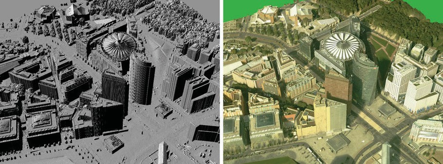

Рис. 7.1. Слева: поверхности, реконструированные по данным аэрофотосъемки.
Справа: те же поверхности после наложения текстуры на записанные изображения.
Показан центр Sony в Берлине, Германия

7.1.1. Топология поверхности
Поверхность S (также край или границу) трехмерного тела можно описать следующим образом:
1) гладкая поверхность, в каждой точке которой $P \in S$ (a) существует непрерывная производная в любом направлении вдоль $S$ и (b) существует принадлежащая $S$ окрестность, топологически эквивалентная $^1$ кругу; или
2) поверхность многогранника, состоящая из плоских многоугольников (например, треугольников). На ребрах многогранника имеются разрывы, но по-прежнему для каждой точки $P \in S$ существует принадлежащая $S$ окрестность, топологически эквивалентная кругу.

Существование для любой точки $P \in$ $S$ окрестности, которая целиком принадлежит $S и топологически эквивалентна кругу, означает, что поверхность $S$ не имеет дырок, через которые «можно было бы заглянуть внутрь тела». См. рис. 7.2 в середине и справа.
В первом случае мы говорим о сладкой поверхности без дырок. Например, таковыми являются поверхности сферы и тора. Во втором случае мы говорим о поверхности многогранника без дырок, см. рис. 7.2 слева. Поверхность, изображенная на рис. 7.1 слева, построена методом триангуляции; одной из граней является земная поверхность, на которой возведены здания, а также все вертикальные поверхности строений (см.

$^1$) Два множества в евклидовом пространстве называются топологически эквивалентными, если существует гомеоморфное преобразование (гомеоморфизм) одного на другое; гомеоморфизмом называется непрерывное взаимно однозначное преобразование, обратное к которому так же непрерывно.

---

298  Глава 7. Трехмерная реконструкция

также рис. 7.4). Мы можем рассматривать ее как поверхность без дырок при условии отсутствия дырок в вычисленной триангуляции.

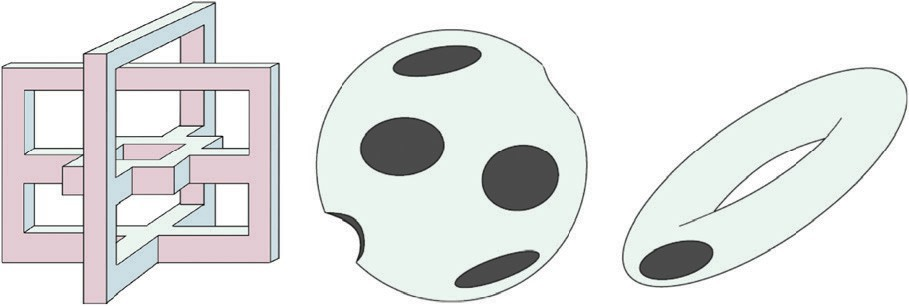

Рис. 7.2. Слева: поверхность многогранника без дырок. В середине и справа: две гладкие поверхности с дырками; поверхность сферы с несколькими вырезанными круговыми участками и поверхность тора с одним вырезанным круговым участком

С точки зрения топологии поверхности, не имеет значения, является участок поверхности многогранным или гладким. Под поверхностью без дырок может пониматься как первая, так и вторая в зависимости от контекста. Топологически оба случая эквивалентны.

**Ориентируемые поверхности.** Ориентированным треугольником называется треугольник с заданным направлением границы – по часовой стрелке или против часовой стрелки, – которое называется ориентацией. Ориентация треугольника индуцирует ориентации его сторон. Два треугольника, входящие в триангуляцию, называются когерентно ориентированными, если они индуцируют противоположные ориентации на общей стороне.

Триангуляция поверхности называется ориентируемой, если возможно ориентировать все составляющие ее треугольники так, что любые два треугольника, имеющих общую сторону, будут ориентированы когерентно. В противном случае триангуляция называется неориентируемой.

Триангуляция ориентируемой поверхности может иметь только одну из двух возможных ориентаций; выбрав ориентацию одного треугольника, мы однозначно определяем ориентацию всей триангуляции (рис. 7.5). Если $Z_1$ и $Z_2$ – триангуляции одной и той же поверхности, то $Z_1$ ориентируема тогда и только тогда, когда $Z_2$ ориентируема.

**Наблюдение 7.1.** Поскольку ориентируемость не зависит от триангуляции, мы можем вести определение: поверхность называется ориентируемой, если для нее существует ориентируемая триангуляция. Отметим также, что

---

«ориентация» (поверхности) и «направление» (вектора) – это разные математические понятия.

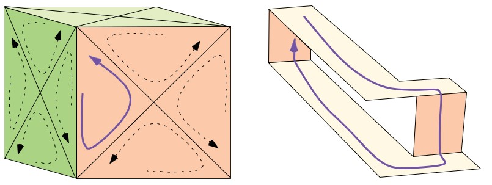

Рис. 7.3. Слева: выбрав ориентацию синего треугольника, мы тем самым определили ориентации всех прочих треугольников, составляющих триангуляцию поверхности без дырок. Добавьте отсутствующие ориентации на верхней грани куба. Справа: лист Мёбиуса – пример неориентируемой поверхности. Показанную на рисунке синюю линию можно продолжить, так что получится петля, проходящая по всем граням поверхности

**Эйлерова характеристика поверхности.** Обозначим $\alpha_0, \alpha_1, \alpha_2$ – число вершин, ребер и треугольных граней в триангуляции $Z$ поверхности. Эйлерова характеристика $Z$ равна
$\chi(Z) = \alpha_0 - \alpha_1 + \alpha_2$      (7.1)

См. врезки 3.1 и 7.2. У любых двух триангуляций одной и той же поверхности эйлерова характеристика одинакова. Этот факт позволяет говорить об эйлеровой характеристике самой поверхности. Эйлерова характеристика – топологический инвариант, т. е. топологически эквивалентные поверхности имеют одинаковые эйлеровы характеристики. Эйлерова характеристика уменьшается с ростом топологической сложности поверхности; для одиночной (т. е. связной) поверхности максимальное значение равно 2. Какова эйлерова характеристика поверхности на левом рис. 7.3?

**Пример 7.1** (эйлерова характеристика поверхности куба и сферы). Поверхности куба и сферы топологически эквивалентны. Каждую грань куба можно разбить на два треугольника. Получается 8 вершин, 18 ребер и 12 треугольников, поэтому эйлерова характеристика такой триангуляции равна 2. Поверхность сферы можно разбить на четыре криволинейных треугольника (рассмотрим вписанный в сферу тетраэдр, его вершины и будут вершинами этих четырех треугольников); получается 4 вершины и 6 простых дуг, так что эйлерова характеристика снова равна 2.

---

300  ➡  Глава 7. Трехмерная реконструкция

**Врезка 7.2** (эйлерова характеристика, числа Бетти и жордановы поверхности). О топологии евклидова пространства уже заходила речь во врезке 3.6. Рассмотрим связное компактное множество $S$ в $\mathbb{R}^3$. Его край называется поверхностью. Множество может иметь полости, не связанные с неограниченным дополнением к множеству, а также ручки.

Родом $g(S)$ поверхности $S$ называется максимальное число разрезов, при котором поверхность еще не теряет связность. Например, род сферы равен 0, а род тора – 1.

Для связного компактного множества $S$ в $\mathbb{R}^3$ (например, сферы $c$ и ручками) самым простым комбинаторным топологическим инвариантом является эйлерова характеристика $\chi \$. Если поверхность связана (т. е. $S$ не имеет полостей), то
$\chi(S) = 2 - 2 \cdot g(S).$

Эйлерова характеристика поверхности сферы (или результата ее топологической деформации, например поверхности куба) $\chi = 2$. Для поверхности тора эйлерова характеристика $\chi = 0$. Если поверхность $S$ несвязная и имеет $b \geq 2$ краевых компонент (т. е.  $b - 1$ полостей), то

$\chi(S) = 2 - 2 \cdot g(S) - (b - 1).$

Теперь рассмотрим поверхность \( S \) ограниченного многограничка общего вида в $\mathbb{R}^3$ (т. е. ограниченное множество, край которого состоит из конечного множества плоских многоугольников). Тогда

$\chi(S) = \alpha_2(S) - \alpha_1(S) + \alpha_0(S) - (b - 1),$

где $b$ – число компонент связности $S$; о смысле $\alpha_0, \alpha_1, \alpha_2$ см. врезку 3.1.

С другой стороны, в случае $b = 1$ справедлива также формула

$\chi(S) = \beta_2(S) - \beta_1(S) + \beta_0(S),$

где $\beta_0, \beta_1, \beta_2$ – числа Бетти множества $S$, названные так в честь итальянского математика Э. Бетти (1823–1892); $\beta_0$ – число компонент связности, $beta_1$ – число «туннелей» («туннель» – это интуитивное понятие, строгое определение $\beta_1$; см., например, в главе 6 книги [R. Klette and A. Rosenfeld. Digital Geometry. Morgan Kaufmann, San Francisco, 2004]), а $\beta_2$ – число полостей. Например, для поверхности тора $\beta_0 = 1$ (она связана), $\beta_1 = 2$ (один туннель внутри поверхности, проходящий через «дырку бублика»), $\beta_2 = 1$ (внутренность поверхности).

Жорданова поверхность (К. Жордан, 1887) определяется как параметризация, описывающая топологическое отображение на поверхность единичной сферы. В компьютерном зрении нас обычно не интересует глобальная параметризация поверхностей (важно только поведение в локальной окрестности). Как правило, общего топологического определения поверхности достаточно. Согласно теореме Гавейна (I. Gawehn), доказанной в 1927 г., любая гладкая поверхность без дырок топологически эквивалентна поверхности многогранника без дырок.

---

**Разделение трехмерного пространства жордановой поверхностью.** В разделе 3.1.1 мы обсуждали разделения в двумерном евклидовом пространстве $\mathbb{R}^2$ и в дискретном изображении. Жорданова кривая топологически эквивалентна окружности, а жорданова поверхность – поверхности сферы. В 1911 г. Л. Э. Я. Брауэр доказал, что любая жорданова поверхность разделяет пространство $\mathbb{R}^3$ с евклидовой топологией на два связных подмножества, при этом сама жорданова поверхность является краем (или границей) обоих подмножеств.

7.1.2. Локальные параметризации поверхности
В компьютерном зрении мы обычно не интересуемся глобальными параметрическими представлениями видимых поверхностей. Для обсуждения методов реконструкции полезны локальные параметризации.

**Представление участков поверхности.** Гладкую поверхность или многогранник можно разбить на (связные) *участки*. Линейные участки поверхности (называемые также *зранями*, например треугольные грани триангулированной поверхности) лежат в плоскости $Z = aX + bY + c,$ (инцидентный этой плоскости).

*Рельефной картой* (elevation map) называется восстановленная поверхность на прямоугольном участке $S$ земной поверхности такая, что каждой точке $P = (X, Y, Z)$ восстановленной поверхности взаимно однозначно соответствует точка $p = (X, Y)$ $\in S$ (см. рис. 7.4). Локальный участок рельефной карты может быть задан в виде *явного представления $Z = F_e(X, Y),$ где плоскость $XY$ соответствует земной поверхности, или неявного представления $F_i(X, Y, Z) = 0.$  В случае участка гладкой поверхности мы предполагаем, что функции в явном или неявном представлении непрерывно дифференцируемы (до нужного порядка).

*Пример 7.2* (поверхность сферы). Видимая поверхность сферы в координатах камеры $X_s, Y_sZ_s$ записывается в виде

$Z_s = F_e(X_s, Y_s) = a - \sqrt{r^2 - X_s^2 - Y_s^2} \tag{7.2}$

в предположении, что сфера расположена перед плоскостью изображения $Z_s = f$, а в неявном виде поверхность той же сферы представляется в виде

$F_i(X_s, Y_s, Z_s) = X_s^2 + Y_s^2 + (Z_s - a)^2 - r^2 = 0, \quad \text{где } a - r > f. \tag{7.3}$

---

302  Глава 7. Трехмерная реконструкция

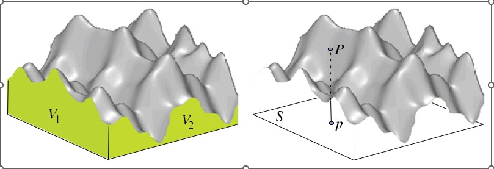

Рис. 7.4. Показанную восстановленную поверхность можно рассматривать как один участок либо как поверхность, состоящую из многих гладких или линейных участков (например, в случае триангуляции). Слева: две видимые вертикальные грани $V_1$ и $V_2$. Справа: точка $p$ на участке $S$ земной поверхности, взаимно однозначно соответствующая точке $P$ на восстановленной поверхности

Евклидово расстояние от точки поверхности $P = (X_s, Y_s, Z_s)$ до центра проекции камеры $O = (0, 0, 0)$ равно $d_2(P, O) = ||P||_2.$ Глубина $P$ равна $Z_s$, это положение $P$ на оптической оси. Можно также предполагать наличие заднего плана $Z = c$ позади (или ниже) видимых поверхностей, тогда высота $P$ равна разности $c - Z_s.$ Таким образом, восстановленную поверхность можно визуализировать в виде карты расстояния, карты глубины или карты высоты, применяя выбранный цветовой ключ для наглядного представления значения. На рис. 7.5 справа приведен пример карты глубины, на котором также видна геометрическая сложность реальных поверхностей.

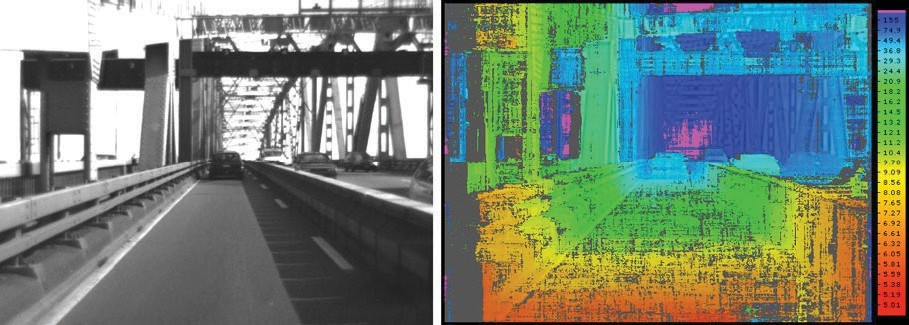

Рис. 7.5. Слева: исходное изображение Bridge для приложения реконструкции поверхностей (с помощью стереоскопического зрения). Справа: визуализация карты глубины с применением цветового ключа в правой части. Если нет уверенности в реконструированной глубине, то соответствующий пиксель окрашен серым. Шкала значений цветового ключа – от 5,01 до 155 (она нелинейна, значение 10,4 находится примерно посередине), это расстояния в метрах

---

**Нормали к поверхности.** Градиентом поверхности $Z = F_e(X, Y)$ называется вектор

$\nabla Z = \text{grad } Z = \left[ \frac{\partial Z}{\partial X}, \frac{\partial Z}{\partial Y} \right]^T.$

Для плоскости $aX + bY + Z = c$ градиент равен $[a, b].$ Нормаль описывается уравнением

$\mathbf{n} = \left[ \frac{\partial Z}{\partial X}, \frac{\partial Z}{\partial Y}, 1 \right]^T = [a, b, 1]^T.$

Как и в формуле (1.16), мы приняли соглашение о том, что нормаль направлена в сторону от плоскости изображения, поэтому третья компонента равна +1.

Единичная нормаль (длины 1) описывается уравнением

${n}^o = \left[ n_1, n_2, n_3 \right]^T = \frac{\mathbf{n}}{\|\mathbf{n}\|_2} = \frac{[a, b, 1]^T}{\sqrt{a^2 + b^2 + 1}}.$

В формулах (7.5) и (7.6) мы также использовали параметры $a$ и  $b$ для обозначения компонент нормали.

Рассмотрим сферу радиуса 1 с центром в начале координат $O$ (ее еще называют _гауссовой сферой_), показанную на рис. 7.6. Угол между вектором $\mathbf{n}^o$ и осью $Z$ называется _полярным углом_ и обозначается $\sigma.$ Угол между вектором, исходящим из $O$ и заканчивающимся в точке $P = (X, Y, 0)$, и осью $X$ называется _азимутальным углом_ и обозначается $\theta.$ Точка $P$ удалена от $O$ на расстояние $\sin \sigma$. Единичная нормаль $\mathbf{n}^o$ пересекает поверхность гауссовой сферы в точке, однозначно определяемой углами $(\sigma, \theta)$, которые называются _сферическими координатами_ точки.

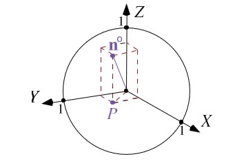

Рис. 7.6. Гауссова сфера с радиусом 1

**Градиентное пространство.** Определим пространство \( ab \) (рис. 7.7 справа), в котором каждая точка \( (a, b) \) представляет градиент \( (a, b) \) в

---

304  ◆  Глава 7. Трехмерная реконструкция

пространстве \( XYZ \) (например, с мировыми координатами) объектов сцены.
Это так называемое *градиентное пространство*.

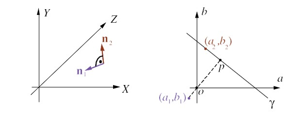

**Рис. 7.7.** Слева: Две ортогональные нормали к поверхности в пространстве сцены XYZ. Справа: градиентное пространство ab, иллюстрирующее значения p и q нормалей $\mathbf{n}_1$ и $\mathbf{n}_2$

Например, рассмотрим плоскость $Z = aX + bY + c$. Тогда точка $(a, b)$ представляет в градиентном пространстве все плоскости, параллельные данной (т. е. с любыми значениями $c \in$ $\mathbb{R}$.

Рассмотрим нормаль $\mathbf{n}_1 = [a_1, b_1, 1]^T$ в пространстве $XYZ$, которая отображается в точку $(a_1, b_1)$ в градиентном пространстве, и нормаль $\mathbf{n}_2 = [a_2, b_2, 1]^T$, ортогональную $\mathbf{n}_1$. См. рис. 7.7 слева. Согласно определению скалярного произведения векторов:

$\mathbf{n}_1 \cdot \mathbf{n}_2 = a_1a_2 + b_1b_2 + 1 = ||\mathbf{n}_1||_2 \cdot ||\mathbf{n}_2||_2 \cdot \cos \frac{\pi}{2} = 0.$

Предположим, что вектор $\mathbf{n}_1$ задан и мы хотим охарактеризовать направление ортогонального вектора $\mathbf{n}_2$. Для заданных $a_1$ и $b_1$ мы имеем прямую γ в градиентном пространстве, определенную уравнением $a_1a_2 + b_1b_2 + 1 = 0,$ в котором $a_2$ и $b_2$ – неизвестные. Геометрически ее можно описать следующим образом:

1) прямая, проходящая через начало координат $o = (0, 0)$ и точку $p$, ортогональна прямой γ;
2) $\sqrt{a_1^2 + b_1^2} = d_2((a_1, b_1), o) = 1/d_2(p, o);$
3) точки $p$ и $(a_1, b_1)$ находятся в противоположных квадратах.

Прямая γ определяется этими условиями однозначно. Она называется _двойственной прямой_ к нормали $\mathbf{n}_1$ или к точке $(a_1, b_1)$. Любое направление $\mathbf{n}_2$, ортогональное $\mathbf{n}_1$, сонаправлено прямой γ.

### 7.1.3. Кривизна поверхности

Этот подраздел адресован читателям, интересующимся математикой. В нем вы найдете руководство по анализу кривизны поверхностей,

---

реконструированных методами компьютерного зрения. Приведенные здесь определения кривизны не используются далее нигде, кроме упражнений 7.2 и 7.6. Существует несколько способов определить кривизну в точке поверхности.

**Гауссова кривизна.** К. Ф. Гаусс определил кривизну поверхности в точке $P,$ введя в рассмотрение «малые» участки поверхности $S_\varepsilon$ радиуса $\varepsilon > 0$ с центром в $P$. Для выбранного \$S_\varepsilon$ обозначим $R_\varepsilon$ множество концов единичных нормалей к поверхности в точках $Q \in$ $S_\varepsilon;$ множество $R_\varepsilon$ образует участок на поверхности единичной сферы. Теперь положим

$K_G(P) = \lim_{\varepsilon \to 0} \frac{\mathcal{A}(R_\varepsilon)}{\mathcal{A}(S_\varepsilon)}, \tag{7.8}$

где $\mathcal{A}$ обозначает площадь. Этот предел называется *ауссовой кривизной* в точке поверхности $P$.

**Нормальная кривизна.** Мы определим также две часто используемые *главные кривизны* $\lambda_1$ и $\lambda_2$ в точке $P$ на гладкой поверхности. Но прежде определим, что такое *нормальная кривизна*.

Пусть $\lambda_1$ и $\lambda_2$ – две различные дуги на данной поверхности, которые пересекаются в точке $P$, и пусть $t_1$ и $t_2$ – касательные векторы к $\lambda_1$ и $\lambda_2$ в точке $P$. На эти векторы натянута касательная плоскость $\Pi_p$ в точке $P$. Будем рассматривать углы $0 \leq \eta < \pi$ в $\Pi_p$ (полуокружность с центром в $P$ ).
Нормаль к поверхности $n_p$ в точке $P$ ортогональна плоскости $\Pi_p$ и коллинеарна векторному произведению $t_1 \times t_2$. Пусть $\Pi_n$ – плоскость, содержащая $n_p$ и расположенная под углом $\eta$ (рис. 7.8).

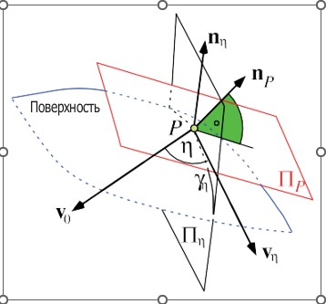

**Рис. 7.8.** Сечение поверхности плоскостью $\Pi_n$

$\Pi_n$ образует двугранный угол $\eta$ с $\Pi_p$ и пересекает поверхность по дуге $\gamma_n.$ ($\Pi_n$ может пересекать поверхность по нескольким дугам, но мы

---

рассматриваем только ту, которая содержит точку $P.$) Обозначим $t_n$, $n$ и $k_n$ касательную, нормаль и кривизну $y_n$ в точке $P.$

Кривизна $k_n$ любой дуги $y \subset \Gamma \cap \Pi_n$, проходящей через $P$, называется нормальной кривизной в точке $P$.

**Пример 7.3** (два примера нормальной кривизны). Рассмотрим горизонтальную плоскость в $R^3,$ проходящую через точку $P = (0, 0, 0).$ Любая дуга $y_n$ является отрезком прямой в этой плоскости, проходящим через $(0, 0, 0);$ имеем $\Pi_n = 0$ и $t_n = y_n.$

Рассмотрим «колпачок» сферы с центром в северном полюсе $P,$ тогда $y_n$ – отрезок большого круга на сфере, $n,$ лежит на прямой, проходящей через $P$ и центр сферы, а $k_n = 1/r$, где $r$ – радиус сферы.

**Главные кривизны.** Напомним, что характеристический полином $p$ матрицы $A$ размере $n \times n$ определен формулой $p(\lambda) = \det(A - \lambda I) = (- \lambda)^n + \ldots + \det(A)$, где $I$ – единичная матрица $n \times n$. Собственные значения $\lambda_1$ матрицы $A$ – это $n$ корней ее характеристического полинома, т. е. уравнения $\det(A - \lambda I) = 0.$

Пусть $v$ – единичный вектор на плоскости $\Pi_p.$ Взятая с обратным знаком производная $-D_v n$ векторного поля $n$ единичных нормалей к поверхности, рассматриваемая как линейное отображение $\Pi_p$ в себя, называется оператором формы (также отображением Вейнгартена или вторым фундаментальным тензором) поверхности.

Обозначим $M_p$, матричное представление отображения Вейнгартена в точке $P$ (в произвольном ортонормированном базисе $\Pi_p$ ), и пусть $\lambda_1$ и $\lambda_2$ собственные значения матрицы $M_p$ размера 2×2. Заметим, что собственные значения не зависят от выбора ортонормированного базиса $\Pi_p.$

Тогда $\lambda_1$ и $\lambda_2$ называются главными кривизнами заданной поверхности в точке $P.$

**Формула Эйлера.** Пусть $w_1$ и $w_2$ – два ортогональных вектора, принадлежащих касательной плоскости $\Pi_p$ в точке $P$, т. е. это касательные векторы, которые определяют нормальные кривизны в направлениях $\eta$ и $\eta + \pi/2.$ Тогда формула Эйлера

$k_{\eta}(p) = \lambda_1 \cdot \cos(\eta)^2 + \lambda_2 \cdot \sin(\eta)^2 \tag{7.9}$

позволяет вычислить нормальную кривизну $k_{\eta}(p)$ в любом направлении $\eta$ в точке $P,$ зная главные кривизны $\lambda_1$ и $\lambda_2$ и угол $\eta$.

**Средняя кривизна.** Среднее арифметическое $(\lambda_1 + \lambda_2)/2$ называется средней кривизной поверхности в точке $P$. Средняя кривизна равна $(k_{\eta}(P) + k_{\eta+\pi/2}(P))/2$ для любого $\eta \in$ $[0, \pi).$

---

Можно показать, что абсолютная величина произведения $\lambda_1 \lambda_2$ равна
гауссовой кривизне $k_c(P)$, определенной формулой (7.8).

**Теорема Мёнье.** Мы можем рассечь поверхность в точке $P$ произволь-
ной плоскостью $\Pi_c,$ идущей в каком-то направлении. Пересечение $\Pi_c$
с поверхностью определяет дугу $\gamma_c$ в окрестности $P,$ и одномерную кри-
визну $k_c$ дуги $\gamma_c$ в точке $P$ можно оценить. Однако нельзя предполагать,
что $\Pi_c$ проходит через нормаль к поверхности $\mathbf{n}_p$ в точке $P$.

Пусть $\mathbf{n}_c$ – главная нормаль к $\gamma_c$ в точке $P$. Теорема Мёнье утверждает,
что нормальная кривизна $k_\eta$ в любом направлении $\eta$ связана с кривиз-
ной $k_c$ и нормалями $\mathbf{n}_p$ и $\mathbf{n}_c$ соотношением

$k_\eta = k_c \cdot \cos(\mathbf{n}_p, \mathbf{n}_c). \tag{7.10}$

Следовательно, оценив две нормальные кривизны $k_\eta$ и $k_{\eta+\pi/2}$, мы смо-
жем оценить среднюю кривизну.

**Врезка 7.3** (Мёнье). Ж. Б. М. Мёнье (1754–1793) – французский дивизионный
генерал, занимался теорией воздухоплавания, считается изобретателем ди-
рижабля.

**Кривизна подобия.** Пусть $k_1$ и $k_2$ – две главные кривизны заданной
поверхности в точке $P$ (выше мы обозначали их $\lambda_1$ и $\lambda_2$ ). Определим ко-
эффициент кривизны $k_3$ следующим образом:

$k_3 = \frac{\min(k_1, |k_2|)}{\max(k_1, |k_2|)}. \tag{7.11}$

Если и $k_1$, и $k_2$ равны нулю, то $k_3$ по определению равно нулю. Из опре-
деления следует, что $0 \leq k_3 \leq 1.$

Кривизна подобия (similarity curvature) \(\mathcal{J}(P)\) определяется следующим
образом:
$$
\mathcal{J}(P) =
\begin{cases}
(k_3, 0), & \text{ если } k_1 \text{ и } k_2 \text{ положительны} \\
(-k_3, 0), & \text{ если } k_1 \text{ и } k_2 \text{ отрицательны} \\
(0, k_3), & \text{ если знаки } k_1 \text{ и } k_2 \text{ различны и } |k_2| > |k_1| \\
(0, -k_3), & \text{ если знаки } k_1 \text{ и } k_2 \text{ различны и } |k_1| > |k_2| 
\end{cases} \tag{7.12} 
$$

Отметим, что $\mathcal{J}(P) \in \mathbb{R}^2.$

---

308  ➔  Глава 7. Трехмерная реконструкция

**Врезка 7.4** (3D-сканеры). На рынке имеется немало продуктов для реконструкции трехмерных поверхностей, обычно они называются «3D-сканеры», или «3D-дигитайзеры». В этой главе рассматриваются сканеры со структурной подсветкой (например, Kinect 1), а также системы, основанные на стереоскопическом зрении и на отражающей способности поверхности. Так, сканеры со структурной подсветкой часто применяются для моделирования человеческого тела (например, сканеры всего тела в киноиндустрии), а стереоскопическое зрение широко используется в аэрофотосъемке, для трехмерной реконструкции зданий и даже для обработки в режиме реального времени, когда необходимо составить представление о трехмерной окружающей среде.
В этой книге не обсуждаются технологии, которые пока слабо интегрированы с компьютерным зрением, как то:
- лазерные сканеры, работающие на основе принципа «времени прохождения сигнала» и дополненные модуляцией длины волны для очень точного измерения расстояния (в новой модели Kinect 2 структурная подсветка заменена временем прохождения сигнала, так что этот принцип стал ближе к компьютерному зрению);
- голография все еще нечасто используется для 3D-измерений, но популярна как средство трехмерной визуализации;
- в контактных датчиках, лазерных приборах сопровождения, оптических и магнитных устройствах слежения за местоположением практически никогда не применяются технологии обработки изображений.

### 7.2. Структурная подсветка
Структурная подсветка – это проекция при калиброванных геометрических условиях некоторой световой конфигурации (например, луча, световой плоскости, решетки или кодированного света в форме сменяющих друг друга двоичных световых комбинаций) на объект, форму которого нужно реконструировать. Обычно используется одна камера и один источник света, а с помощью калибровки мы должны определить положение источника относительно камеры. На рис. 7.9 слева показана одна из возможных установок.
В этом разделе описывается математика, необходимая для реконструкции поверхностей методом структурной подсветки.

7.2.1. Проекция световой плоскости
**Нахождение проекции световой плоскости.** Освещенная прямая на трехмерной сцене прослеживается в пикселях изображения. Мы

---

анализируем спроецированную прямую в одномерных сечениях, индексированных числами $k = 1, ..., k_{end},$ ортогональных направлению касательной в пикселе $s_k,$ где изображение имеет локальный максимум $u_k$ (рис. 7.10).

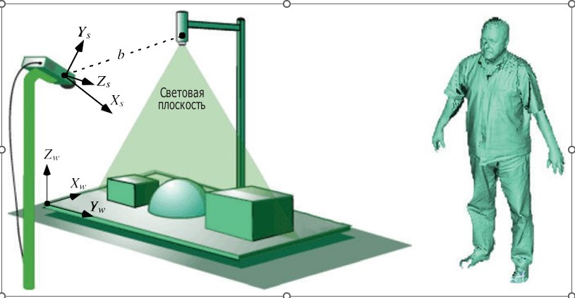

**Рис. 7.9.** *Слева*: источник света (лазер) создает качающуюся световую плоскость (рисунок).  
Рассматривается на рисунке и на рисунке. Следующая поверхность тела, реконструированная методом структурной подсветки.

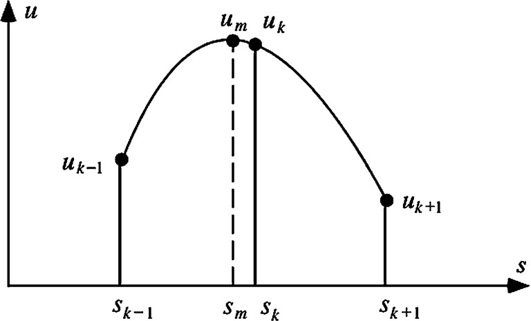

**Рис. 7.10.** Построенный профиль яркости в направлении строки или столбца (в идеале ортогональной направлению касательной к записанной в изображении световой плоскости). Мы рассматриваем пиксели и их яркость в точке $s_{k-1}$ слева и в точке $s_{k+1}$ справа от $s_k,$ чтобы найти идеальную позицию $s_m$, (где достигается максимум $u_m,$ который не виден в изображении) с субликсельной точностью.

Мы измеряем уровни яркости $u_{k-1}$ и $u_{k+1},$ в позициях пикселей $s_{k-1}$ и $s_{k+1},$ расположенных на выбранном расстоянии от $s_k.$ Для аппроксимации яркости в сечении, проходящем через спроецированную прямую,

---

используется квадратичный полином $u = a \cdot s^2 + b \cdot s + c.$ Коэффициенты
полинома $a, b$ и $c$ находятся из системы уравнений

$$
\begin{bmatrix}a & b & c\end{bmatrix}^\top =
\begin{bmatrix}
s_{k-1}^2 & s_{k-1} & 1 \\
s_k^2 & s_k & 1 \\
s_{k+1}^2 & s_{k+1} & 1
\end{bmatrix}^{-1}
\begin{bmatrix}u_{k-1} & u_k & u_{k+1}\end{bmatrix}^\top
\tag{7.13}
$$

(На самом деле $c$ не нужно для определения $s_m$ ). Затем мы находим
положение $s_m$ спроецированной прямой с субпиксельной точностью;
полином достигает максимума в точке $s_m = -b/2a.$ Почему?

**Генерирование световых плоскостей с помощью кодированно-
го света.** Вместо того чтобы генерировать за один раз одну световую
плоскость, мы можем с тем же успехом использовать $n$ проецируемых
двоичных комбинаций для генерирования $2^n$ световых плоскостей, за-
кодированных в $n$ отснятых изображениях.

Рассмотрим диапроектор для проецирования $n$ слайдов, каждый
из которых содержит двоичную комбинацию с разрешением $2^n \times 2^n$
(рис. 7.11). На каждом слайде столбец либо черный (не пропускает свет),
либо белый. Следовательно, один столбец во всех слайдах генерирует
на протяжении времени некую световую плоскость, описываемую дво-
ичной последовательностью «освещена» / «не освещена». Зная такую
последовательность для конкретной точки поверхности, мы можем по-
нять, какая световая плоскость отображалась на эту точку.

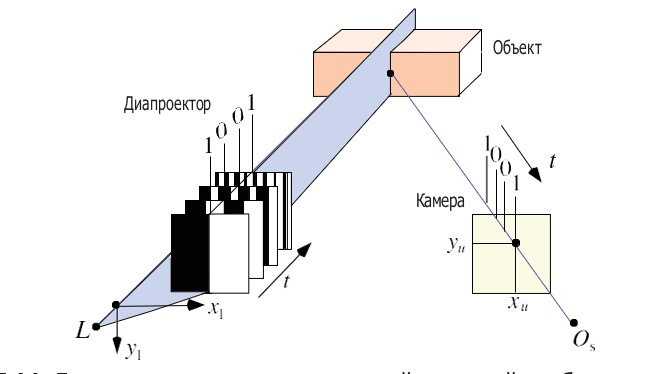

Рис. 7.11. Диапроектор проецирует по одной двоичной комбинации, так что
в каждый момент освещены точки поверхности, попавшие в белые столбцы
(черные столбцы не пропускают свет). Таким образом, последовательность
слайдов генерирует в точке поверхности двоичный код $( 1 = освещена этим
слайдом, 0 = не освещена).$ На рисунке показана одна световая плоскость,
определенная последовательными двоичными комбинациями

---

Спроецировав $n$ слайдов в моменты $t = 1, \ldots, n,$ мы записали $n$ изображений и сгенерировали $2^n$ световых плоскостей. (Можно уменьшить число слайдов до $n - 1,$ предположив, что световые плоскости в левой части отснятой сцены нельзя спутать со световыми плоскостями в правой части.)

Чтобы уменьшить количество ошибок, рекомендуется использовать в проецируемых слайдах код Грэя, а не обычный двоичный код.

**Врезка 7.5** (Грэй и код Грэя). Этот двоичный код был предложен американским физиком Ф. Грэем (1887–1969). Последовательные целые числа представляются двоичными числами, различающимися только в одном разряде. В приведенной ниже таблице код Грэя иллюстрируется на примерах чисел от 0 до 7:

| Целые    | 0   | 1   | 2   | 3   | 4   | 5   | 6   | 7   |
|---|---|---|---|---|---|---|---|---|
| Обычный код | 000  | 001  | 010  | 011  | 100  | 101  | 110  | 111  |
| Код Грэя    | 000  | 001  | 011  | 010  | 110  | 100  | 101  | 111  |

### 7.2.2. Анализ световой плоскости
Вспомните системы координат камеры и мира, изображенные на рис. 6.17 и 7.9. Кроме того, теперь у нас есть еще и источник света.

**Системы координат камеры, источника света и мировая.** Камера расположена в трехмерном пространстве, и с ней связана левосторонняя (для определенности) система координат $X_s Y_z Z_s.$ Центр проекции находится в начале координат $O_s.$ Оптическая ось камеры совпадает с осью $Z_s.$ Плоскость изображения параллельна плоскости $X_s Y_s$ и находится от нее на (эффективном) фокусном расстоянии $Z_s = f .$ С изображением связана либо левосторонняя (с направлением визирования в сторону $O_s$ ), либо правосторонняя (точка съемки совпадает с $O_s$ ) система координат $xy$ .

Из-за дисторсии объектива пространственная точка $P$ проецируется в точку $p_d = (x_u, y_u)$ на плоскости изображения, где индекс $d$ означает «distorted» (искаженная). В предположении модели камеры-стенола (т. е. центральной проекции) позиция $p_d$ корректируется и преобразуется в $p_u = (x_u, y_u)$ , где индекс $u$ означает «undistorted» (неискаженная). Применяя теорему о луче, получаем уравнения центральной проекции

$x_u = \frac{fX_s}{Z_s} \quad u \quad y_u = \frac{fY_s}{Z_s}. \tag{7.14}$

---

Точки трехмерного пространства представлены в мировой системе координат $X, Y, Z$ . Координаты камеры можно преобразовать в мировые с помощью поворота и последующего параллельного переноса, что удобно описывается в 4-мерных однородных мировых координатах. Для структурной подсветки требуется (в общем случае) также откалибровать используемые источники света. Необходимо знать положение (т. е. позицию и направление) источника света в мировой системе координат. Например, мы должны определить длину базы $b$ , т. е. расстояние между центром проекции камеры и точкой, из которой исходят световые лучи (рис. 7.9).

**Двумерный случай.** Сначала обсудим гипотетический случай камеры на плоскости, а затем перейдем к расположению камеры в трехмерном пространстве. Предположим, что в результате калибровки определены углы  $\alpha$ и $\beta$ и длина базы $b$ . Нам нужно вычислить положение $P$ . См. рис. 7.12.

![Diagram]

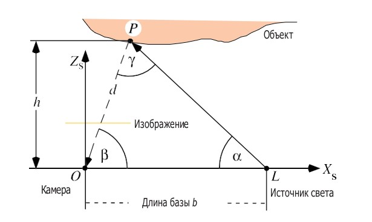

**Рис. 7.12.** Простой гипотетический случай: камера, источник света  
и неизвестная точка на поверхности $P$ принадлежат одной плоскости; предполагается, что $L$ лежит на оси $X_s$

Центры проекции $O$ и $L$ вместе с неизвестной точка $P$ образуют треугольник. Мы определим положение $P$ с помощью *триангуляции*, применив хорошо известные геометрические факты, в т. ч. теорему синусов:

$\frac{d}{\sin \alpha} = \frac{b}{\sin \gamma}. \tag{7.15}$

Отсюда следует, что

$d = \frac{b \cdot \sin \alpha}{\sin \gamma} = \frac{b \cdot \sin \alpha}{\sin (\pi - \alpha - \beta)} = \frac{b \cdot \sin \alpha}{\sin (\alpha + \beta)}. \tag{7.16}$

---

и, наконец,

$P = (d \cdot \cos \beta, d \cdot \sin \beta) \tag{7.17}$

в координатах $X_Z$ . Угол $\beta$ определяется по положению спроецированной (освещенной) точки $P$ в гипотетическом одномерном изображении.

**Трехмерный случай.** Теперь рассмотрим настоящий трехмерный случай. Предположим, что величина $b$ определена в результате калибровки источника света, а угол контролируется механизмом перемещения световой плоскости. См. рис. 7.13.

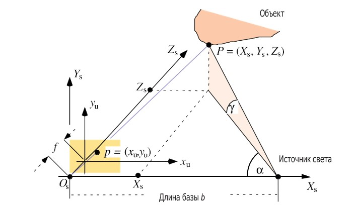

Рис. 7.13. Для простоты считаем, что источник света $L$ лежит на оси $X_s$

Согласно теореме о луче (центральной проекции), $X_s / x_u = Z_s / f = Y_s / y_u$ , а из тригонометрии прямоугольного треугольника мы знаем, что $\tan \alpha = Z_s / (b - X_s)$ . Отсюда следует, что

$Z = \frac{X}{x} \cdot f = \tan \alpha \cdot (b - X) \quad и \quad X \cdot \left( \frac{f}{x} + \tan \alpha \right) = \tan \alpha \cdot b. \tag{7.18}$

В результате получаем решение

$X = \frac{\tan \alpha \cdot b \cdot x}{f + x \cdot \tan \alpha}, \quad Y = \frac{\tan \alpha \cdot b \cdot y}{f + x \cdot \tan \alpha}, \quad u \quad Z = \frac{\tan \alpha \cdot b \cdot f}{f + x \cdot \tan \alpha}. \tag{7.19}$

Но почему в эти формулы не входит $Y$ ?

В общем случае мы должны рассмотреть ситуацию, когда источник света $L$ не лежит на оси $X_s$ , но вывод формулы для нее оставляем читателю в качестве упражнения. См. упражнение 7.7.

---

# 7.3. Стереоскопическое зрение

Бинокулярное зрение – реальность, и зрение человека – тому доказательство. Трудная часть задачи – определить соответственные точки на левом и правом видах сцены (пример см. на рис. 7.14), т. е. точки, являющиеся проекцией одной и той же точки на поверхности. (Этой задаче мы посвятим целую главу 8.) В предположении, что она уже решена и у нас имеется пара откалиброванных камер (известны их внутренние и внешние параметры), не составляет труда вычислить глубину, т. е. расстояние до видимой точки поверхности.

---

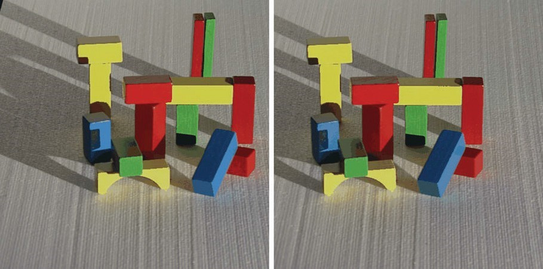

**Рис. 7.14.** Входная пара для системы стереоскопического зрения, идея которой обеспечить каноническую геометрию системы за счет использования камер, точно смонтированных на оптической скамье (Берлинский технический университет, лаборатория компьютерного зрения, 1994 г.). В наши дни более эффективна калибровка камеры с последующей ректификацией изображений на этапе подготовки исходных данных (см. раздел 6.3.2)

В этом разделе объясняется геометрическая модель стереоскопического зрения, в центре которой находятся понятия *эпиполярной геометрии* и диспаратности. Описано также, как использовать диспаратность для вычисления глубины сцены.

## 7.3.1. Эпиполярная геометрия

Мы имеем две камеры, находящиеся в общем положении, а не просто «правую» и «левую». Будем считать, что к камерам применима модель стенола, и обозначим центры проекции $O_1$ и $O_2$ (рис. 7.15). Мы рассматриваем евклидову геометрию в $\mathbb{R}^3$ , игнорируя на время ограничения, налагаемые дискретностью изображений.

---

7.3. Стереоскопическое зрение 315

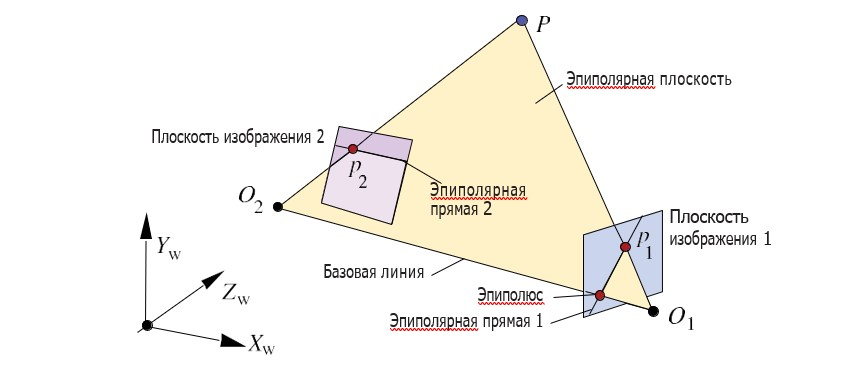

Рис. 7.15. Эпиполярная геометрия двух камер в общем положении

Точка $P$ с мировыми координатами $X_w Y_w Z_w$ , проецируется в точку $p_1$ изображения 1 (точно, а не в позицию пикселя) и в соответственную точку $p_2$ изображения 2. Задача сопоставления стереоизображений (предмет следующей главы) – найти точку $p_2$ , зная $p_1$ .

Как известно, три неколинёвные точки в трехмерном пространстве однозначно определяют плоскость. Точки $O_1$ , $O_2$ и неизвестная точка $P$ определяют эпиполярную плоскость. Точки $O_1$ , $O_2$ и точка $p_1$ определяют ту же самую плоскость.

Пересечение плоскости изображения с эпиполярной плоскостью определяет эпиполярную прямую. При поиске соответственной точки $p_2$ можно ограничиться только эпиполярной прямой в изображении 2.

**Наблюдение 7.2.** Если в результате калибровки камер стало известно положение центров проекции $O_1$ и $O_2$ в мировой системе координат, то, зная точку $p_1$ в изображении 1, мы уже можем сказать, на какой прямой искать соответственную точку $p_2$ во втором изображении; необязательно искать ее «ясюбу».

Это ограничение на геометрическое место возможных точек очень важно для сопоставления стереоизображений.

**Каноническая эпиполярная геометрия.** В разделе 6.1.3 мы познакомились с канонической геометрией стереоскопической системы, которую теперь можем описать в терминах канонической эпиполярной геометрии. См. рис. 6.11, на котором имеются левая и правая камеры.

Там точка $P$ определяет эпиполярную плоскость, которая пересекает плоскости обоих изображений по одной и той же строке. Если начать с точки $p_1 = (x_u, y_u)$ от левой камеры, то соответственная точка (если $P$ видна правой камере) находится в строке $y_u$ изображения с правой камеры.

---

Где находятся эпиполюсы в канонической эпиполярной геометрии?  
Их можно точно описать в 4-мерных однородных координатах. Это бес-конечно удаленные точки.

7.3.2. Бинокулярное зрение в канонической геометрии стереоскопической системы  

После геометрической ректификации две соответственные точки в левом и правом изображениях оказываются в строках с одним и тем же номером. Если начать, к примеру, с пикселя $p_L = (x_L, y)$ в левом изображении, то соответственный пиксель $p_R = (x_R, y)$ в правом изображении удовлетворяет условию $x_R \leq x_L$ , т. е. пиксель $p_R$ находится слева от пикселя $p_L$ в массиве всех пикселей размера $N_{cols} \times N_{rows}$ . Иллюстрация такого порядка показана на рис. 6.11. Если быть совсем точным, то координаты $c_{xL}$ и $c_{xR}$ главных точек левой и правой камер могут оказывать влияние на этот порядок в местах, где $x_L$ и $x_R$ почти совпадают, см. (6.5). Но для простоты мы будем предполагать, что неравенства $x_R \leq x_L$ и $x_{uR} \leq x_{uL}$ справедливы для неискаженных координат.

**Диспаратность в общем случае.** Пусть имеются два прямоугольных изображения $I_i$ и $I_j$ одинакового размера $N_{cols} \times N_{rows}$ , поданных на вход системы стереозрения; как и в разделе 6.3.2, мы используем в общем случае индексы $i$ и $j$ , а не слова «левая» и «правая». Рассмотрим наложение изображений друг на друга в системе координат изображения $xy$ , показанное на рис. 7.16.

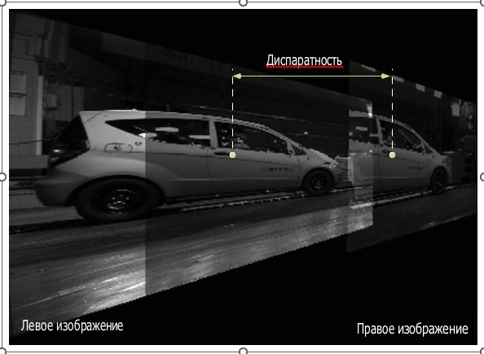

Рис. 7.16. В продолжение рис. 6.19: два ректифицированных изображения наложены друг на друга в одном массиве $N_{cols} \times N_{rows}$ пикселей. Диспаратность показана на примере двух соответственных точек

---

Точка $P = (X, Y, Z)$ проецируется в точку $p_i i$ -го и в точку $p_j j$ -го изображения. Тем самым определены векторы диспаратности (виртуального сдвига)

$d_{ij} = p_i - p_j \quad или \quad d_{ji} = p_j - p_r. \tag{7.20}$

Скалярная диспаратность $d_{ij} = d_{ji}$, по определению, равна модулю $||\mathbf{d}_{ij}||_2$ =  $d_2(p_i, p_j)$ вектора $\mathbf{d}_{ij}$ . Имеем $||\mathbf{d}_{ij}||_2$ =  $||\mathbf{d}_{ji}||_2$ .

**Диспаратность в канонической геометрии стереоскопической системы.** В этом случае мы имеем левое и правое изображения. Пиксель $p_L = (x_L, y)$ левого изображения соответствует пикселю $p_R = (x_R, y)$ правого изображения. Поскольку $x_R \leq x_L$ , диспаратность равна $x_L - x_R$ .

**Триангуляция в канонической геометрии стереоскопической системы.** Теперь у нас есть все необходимое, чтобы перейти от входных стереоизображений к результатам, т. е. восстановить пространственные точки $P = (X, Y, Z)$ в координатах камеры или в мировых координатах.

Применив (6.4) и (6.5), мы восстановим неизвестные видимые точки $P$ в системе координат левой камеры $P = (X_s, Y_s, Z_s)$ по неискаженным координатам пикселей изображения $(x_{uL}, y_{uR})$ и $(x_{uR}, y_{uR})$ на входе, которые удовлетворяют условиям $y_{uL} = y_{uR} \times x_{uR} \leq x_{uL}$ .

Длина базы обозначена $b > 0$ , и, как всегда, $f$ – унифицированное фокусное расстояние. Прежде всего мы можем исключить $Z_s$ из уравнений (6.4) и (6.5):

$Z_s = \frac{f \cdot X_s}{x_{uL}} = \frac{f \cdot (X_s - b)}{x_{uR}}. \tag{7.21}$

Из (7.21) находим $X_s$

$X_s = \frac{b \cdot x_{uL}}{x_{uL} - x_{uR}}. \tag{7.22}$

Подставив это значение \( X_s \) в (7.21), получаем

$Z_s = \frac{b \cdot f}{x_{uL} - x_{uR}}. \tag{7.23}$

Наконец, подставляя $Z_s$ в (6.4) или (6.5), получаем

$Y_s = \frac{b \cdot y_u}{x_{uL} - x_{uR}}, \tag{7.24}$

где $y_u = y_{uL} = y_{uR}$ .

---

**Наблюдение 7.3.** Два соответственных пикселя $(x_{L}, y) = (x_{uL} + c_{xL}, y_{uL} + c_{yL})$
$u(x_{R}, y) = (x_{uR} + c_{xR}, y_{uR} + c_{yR})$ однозначно определяют свой общий прообраз $P = (X, Y, Z)$
в трехмерном пространстве по формулам триангуляции (7.22), (7.23) и (7.24).

**Обсуждение формул триангуляции.** Если диспаратность $x_{uL} - x_{uR} = 0$ ,
значит, прообраз $P = (X, Y, Z)$ находится в бесконечности. Чем больше
диспаратность $x_{uL} - x_{uR}$ , тем ближе прообраз $P$ к камерам.

Поскольку координаты пикселей изображения — целые числа, значения диспаратности $x_{uL} - x_{uR}$ тоже могут быть только целыми (мы игнорируем постоянный, но, возможно, нецелый сдвиг на координаты
главной точки). Из-за нелинейности уравнений триангуляции разница
на 1 между $x_{uL} - x_{uR} = 0$ и $x_{uL} - x_{uR} = 1$ означает переход от бесконечности к
конечному значению, та же разница между $x_{uL} - x_{uR} = 1$ и $x_{uL} - x_{uR} = 2$ означает, что прообраз сильно приблизился к камере, но разность между
$x_{uL} - x_{uR} = 99$ и $x_{uL} - x_{uR} = 100$ соответствует лишь очень небольшому изменению расстояния до камер. См. рис. 7.17.

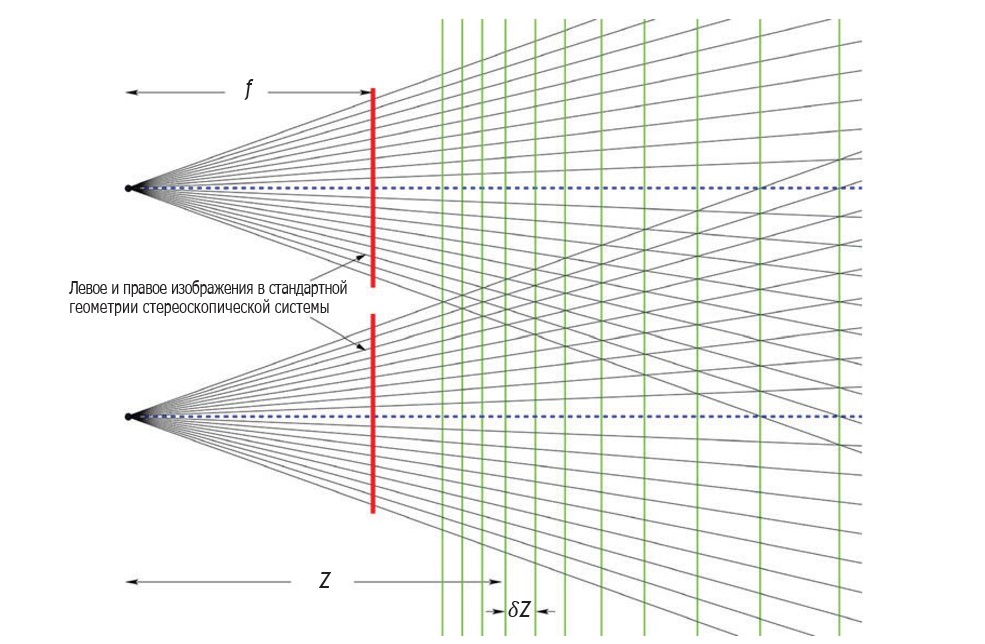

Рис. 7.17. На этом рисунке показаны пересекающиеся прямые, проходящие
через позиции пикселей в двух стереоизображениях. Пересечения отмечают
потенциальное положение точки $P$ в трехмерном пространстве, найденное
благодаря диспаратности, определяемой разностью координат пикселей.
Расстояние $\delta Z$ между последовательными уровнями глубины растет нелинейно

---

**Наблюдение 7.4.** Если не пытаться уточнить измерения, то количество доступных значений диспаратности между $d_{\text{max}}$ и $0$ определяет количество уровней глубины. Эти уровни распределены нелинейно: чем ближе к камерам, тем плотнее, а чем дальше, тем реже.

Если увеличить длину базы $b$ и фокусное расстояние $f$ , то можно будет получить больше уровней глубины, но при этом уменьшится количество пикселей, которым есть соответствие во втором изображении. Увеличение разрешения изображения – обычный способ повышения точности уровней глубины, но за это приходится расплачиваться увеличением времени вычислений.

**Реконструкция разреженных и плотных данных о глубине.** Одна пара соответственных точек дает одну реконструированную точку в пространстве. Методы поиска соответствий иногда дают много соответственных точек в паре стереоизображений, а иногда очень мало. На рис. 7.18 слева несколько разреженных соответствий найдено близко к границам внутри изображения с применением локального (неиерархического) сопоставителя стереоизображений на основе корреляции. Такая стратегия сопоставления использовалась на заре компьютерного зрения. На рис. 7.18 справа показано плотное соответствие, демонстрирующее, что иерархическое сопоставление на основе корреляции уже дает разумные результаты.

В процессе сопоставления стереоизображений возможны ошибки. Так что даже если найдено всего несколько соответствий, их качество все равно нужно тщательно проверить.

**Реконструкция разреженных данных о глубине во встраиваемых системах технического зрения.** Разреженное сопоставление стереоизображений даже в наши дни представляет интерес в «небольших» встраиваемых системах технического зрения, где время расчетов и точность результатов имеют первостепенное значение. На рис. 7.19 показаны результаты сопоставителя стереоизображений, основанного на модифицированном детекторе признаков FAST. Сами изображения сняты с квадрокоптера.

7.3.3. Бинокулярное зрение в конвергентной системе

Чтобы максимально увеличить пространство, видимое обеими камерами, полезно отойти от канонической геометрии стереоскопической системы и воспользоваться конвергентивной конфигурацией со сходящимися направлениями визирования, показанной на рис. 7.20.

---

320  Глава 7. Трехмерная реконструкция
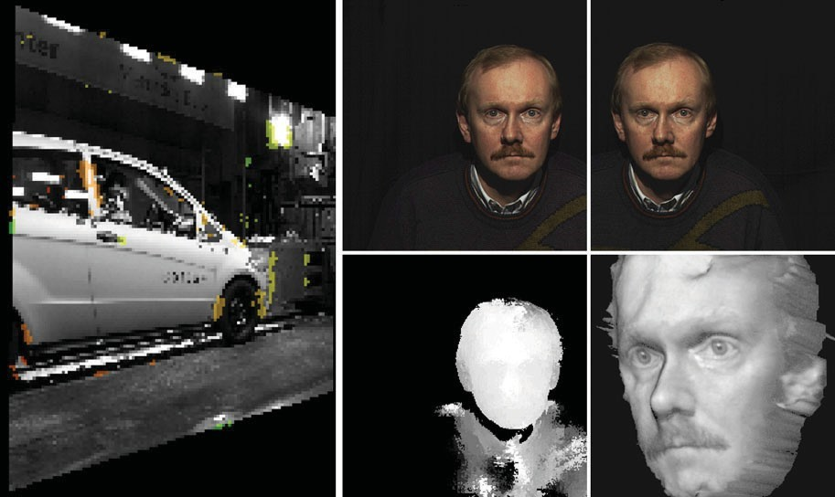

Рис. 7.18. Слева: разреженные соответственные пиксели, найденные методом сопоставления стереоизображений, показаны цветными точками, причем цвета кодируют глубину (это продолжение рис. 7.16). Справа: входная стереопара Andreas (вверху), плотная карта глубины, на которой глубина кодируется уровнем яркости, а также триангулированное и текстурированное представление поверхности, полученное на основе сопоставления (Берлинский технический университет, лаборатория компьютерного зрения, 1994)

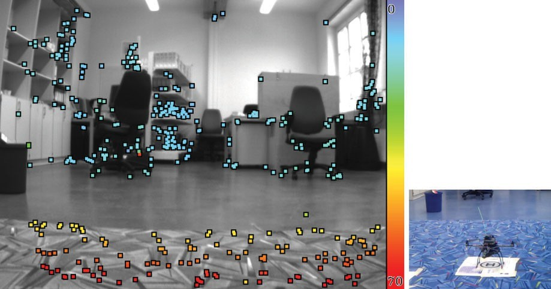

Рис. 7.19. Слева: разреженные соответствия, найденные алгоритмом сопоставления на основе анализа признаков, встроенного в ПО квадрокоптера (Побингенский университет, 2013). Справа: стереокамеры смонтированы на этом квадрокоптере

---

**Наклоненные камеры с соответственными строками изображений.** Будем предполагать декартову систему координат XYZ. На рис. 7.20 показаны оси $X$ и $Z$, а ось $Y$ направлена в сторону зрителя. Оптические оси левой и правой камер пересекаются в точке $C$ на оси $Z$ . Координаты левой камеры обозначаются $X_L Y_L Z_L$ , а координаты правой $-X_R Y_R Z_R$ . Центры проекций находятся в точках $O_L$ и $O_R$ , оба лежат на оси $X$. Отрезок $O_L O_R$ называется базой определенной таким образом конвергентной системы бинокулярного зрения, а величина $b - \partial ливой базы$ .

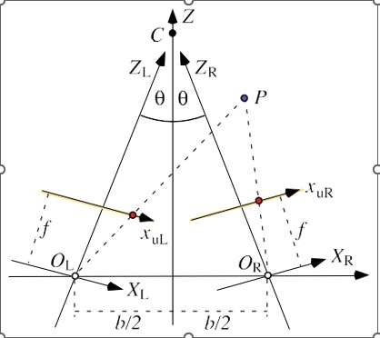

Рис. 7.20. Левая и правая камеры симметричны относительно оси $Z$; их оптические оси пересекаются в точке схождения $C$ на оси $Z$ .

Расстояние между точками $O_L$ и $O_R$ равно $b$, а угол между оптическими осями $Z_L$ и $Z_R$ и осью $Z$ одинаков и равен $\theta$ . Пространственная точка $P$ проецируется в точки изображений с абсциссами $x_{uL}$ и $x_{uR}$ и одинаковыми ординатами $y_u = y_{uL} = y_{uR}$ (это вариант ректификации, достигаемый калибровкой камер). Фокусное расстояние обеих камер $f$ также одинаково.

**Преобразования координат.** Система XYZ преобразуется в $X_L Y_L Z_L$ поворотом

$$ 
\begin{bmatrix}
\cos(-\theta) & 0 & -\sin(-\theta) \\
0 & 1 & 0 \\
\sin(-\theta) & 0 & \cos(-\theta)
\end{bmatrix}
=
\begin{bmatrix}
\cos(\theta) & 0 & \sin(\theta) \\
0 & 1 & 0 \\
-\sin(\theta) & 0 & \cos(\theta)
\end{bmatrix} \tag{7.25}
\]
на угол \(-\theta\) вокруг оси \(Y\) с последующим параллельным переносом
\[
\left[ X - \frac{b}{2}, Y, Z \right]^T, \tag{7.26}
$$

---

322  Глава 7. Трехмерная реконструкция

т. е. на величину $b/2$ влево. Тем самым определяется аффинное преобразование

$$
\begin{bmatrix}
X_L \\
Y_L \\
Z_L
\end{bmatrix}
=
\begin{bmatrix}
\cos(\theta) & 0 & \sin(\theta) \\
0 & 1 & 0 \\
-\sin(\theta) & 0 & \cos(\theta)
\end{bmatrix}
\begin{bmatrix}
X - \frac{b}{2} \\
Y \\
Z
\end{bmatrix}. \tag{7.27}
\]
Аналогично
\[
\begin{bmatrix}
X_R \\
Y_R \\
Z_R
\end{bmatrix}
=
\begin{bmatrix}
\cos(\theta) & 0 & -\sin(\theta) \\
0 & 1 & 0 \\
\sin(\theta) & 0 & \cos(\theta)
\end{bmatrix}
\begin{bmatrix}
X + \frac{b}{2} \\
Y \\
Z
\end{bmatrix}. \tag{7.28}
\]
Рассмотрим точку \( P = (X, Y, Z) \) в системе координат \( XYZ \), спроецированную в точки \( x_{uL} y_u \) и \( x_{uR} y_u \) в левой и правой системах координат соответственно. Согласно общим уравнениям центральной проекции:
\[
x_{uL} = \frac{f \cdot X_L}{Z_L}, \quad y_u = \frac{f \cdot Y_L}{Z_L} = \frac{f \cdot Y_R}{Z_R} \quad u \quad x_{uR} = \frac{f \cdot X_R}{Z_R}. \tag{7.29}
\]
Отсюда получаем
\[
x_{uL} = f \frac{\cos(\theta) \left( X - \frac{b}{2} \right) + \sin(\theta) \cdot Z}{- \sin(\theta) \left( X - \frac{b}{2} \right) + \cos(\theta) \cdot Z}, \tag{7.30}
\]
\[
y_u = f \frac{Y}{- \sin(\theta) \left( X - \frac{b}{2} \right) + \cos(\theta) \cdot Z}, \tag{7.31}
\]
\[
x_{uR} = f \frac{\cos(\theta) \left( X + \frac{b}{2} \right) - \sin(\theta) \cdot Z}{\sin(\theta) \left( X + \frac{b}{2} \right) + \cos(\theta) \cdot Z}. \tag{7.32}
$$

Таким образом, получается следующая система уравнений:

---

$[-x_{uL} \cdot \sin(\theta) - f \cdot \cos(\theta)]X + [x_{uL} \cdot \cos(\theta) - f \cdot \sin(\theta)]Z = -\left[ \frac{b}{2}x_{uL} \cdot \sin(\theta) + \frac{b}{2}f \right], \tag{7.33}$

$[-y_u \cdot \sin(\theta)]X + [-f]Y + [y_u \cdot \cos(\theta)]Z = \left[ \frac{b}{2}y_u \cdot \sin(\theta) \right], \tag{7.34}$

$[x_{uR} \cdot \sin(\theta) - f \cdot \cos(\theta)]X + [x_{uR} \cdot \cos(\theta) + f \cdot \sin(\theta)]Z = -\left[ \frac{b}{2}x_{uR} \cdot \sin(\theta) - \frac{b}{2}f \right]. \tag{7.35}$

**Решение относительно неизвестной точки в трехмерном пространстве.** Может показаться трудным проделывать все эти вычисления для одной лишь проецируемой точки \( P = (X, Y, Z) \). (Неужели люди делают «это» для всех соответственных точек, видимых левым и правом глазом, чтобы свести изображения и оценить расстояния до объектов?) На самом деле эта система уравнений позволяет точно вычислить координаты XYZ проецируемой точки $P$ . (Биологическая система зрения не измеряет расстояния точно, а лишь дает оценки.) Обозначим $a_1 = [-x_{uL} \cdot \sin(\theta) - f \cdot \cos(\theta)], \ldots, c_0 = -[(b/2)x_{uR} \cdot \sin(\theta) - (b/2)f]$ коэффициенты в показанной выше системе уравнений, все их можно найти в предположении, что азимутальный угол θ фиксирован, фокусное расстояние f известно и идентифицирована пара соответственных точек изображений с координатами $(x_{uL}, y_u) \) и \( (x_{uR}, y_u)$ , являющихся проекциями одной и той же точки $P = (X, Y, Z)$ :

$a_1X + a_3Z = a_0, \tag{7.36}$

$b_1X + b_2Y + b_3Z = b_0, \tag{7.37}$

$c_1X + c_3Z = c_0. \tag{7.38}$

Из этой системы легко найти $X, Y \) и \( Z \)$ .

**Наблюдение 7.5.** Конвергентная система вычислительно не намного сложнее канонической стереоскопической системы.

**Вергенция.** Если точка $P$ особенно интересна человеку, то его зрительная система фокусируется на этой точке (это называется вергенцией). Геометрически это означает, что оба глаза движутся в противоположных направлениях, так что оси $Z_L$ и $Z_R$ пересекаются в точности в

---

точке P. В этом случае азимутальные углы θ уже не равны. Возможно, в будущем камеры смогут реализовать вергенцию. Тогда для описания преобразований координаты будет более эффективен общий аппарат линейной алгебры (с точки зрения краткости, ясности и общности).

### 7.4. Фотометрический метод анализа стереоизображений

В предыдущем разделе для реконструкции трехмерного тела нам был нужен источник света (обычно Солнце) и две (или более) статические или подвижные камеры. Теперь же мы будем использовать одну статическую камеру и несколько статических источников света, которые можно включать и выключать во время фотографирования. Технология называется фотометрический метод анализа стереоизображений (ФАС) (photometric stereo method – PSM). Пример с тремя источниками света показан на рис. 7.21; на каждой фотографии рука освещена только одним из трех источников.

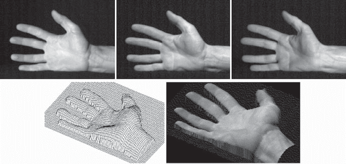

Рис. 7.21. Вверху: три исходных изображения для ФАС; во время фотографирования рука должна быть неподвижной. Внизу: поверхность, реконструированная методом ФАС с 3 источниками света (Берлинский технический университет, 1996)

Сначала мы обсудим ламбертовскую отражательную способность в качестве примера того, как поверхности отражают свет, а затем опишем, как использовать ФАС с тремя источниками света для вывода градиентов поверхности. Напоследок мы расскажем, как по градиентам поверхности реконструировать трехмерное тело.

---

7.4. Фотометрический метод анализа стереоизображений 325

7.4.1. Ламбертовская отражательная способность

**Предположение о точечном источнике света.** Чтобы упростить математическое описание, будем предполагать, что каждый источник света можно представить единственной точкой в пространстве $\mathbb{R}^3$ ; этот источник излучает свет равномерно во всех направлениях. Конечно, реальный источник света имеет ограниченную дальность, характеризуется конкретной кривой распределения энергии $L(\lambda)$ (см. пример на рис. 1.25 слева) и имеет геометрическую форму. Но мы предполагаем, что источники «не слишком близки» к интересующим нас объектам, поэтому _предположение о точечном источнике света_ правомерно.

Предполагается, что источник света $L$ находится в направлении $s_L = [a_L, b_L, 1]^T$ по отношению к освещаемой поверхности (интересующим нас объектам) и излучает свет интенсивности $E_L$ . Постоянную $E_L$ можно рассматривать как интеграл по кривой распределения энергии источника $L$ в видимой части спектра.

**Врезка 7.6** (Ламберт и его закон косинуса). Швейцарский физик и математик И. Г. Ламберт (1728–1777) внес вклад во многие дисциплины, в т. ч. геометрическую оптику, цветовые модели и теорию отражательной способности поверхностей. Он также первым доказал, что число $\pi$ иррационально. Ламбертовская отражательная способность характеризуется законом косинусов (закон Ламберта), опубликованным в 1760 г.

**Закон косинуса Ламберта.** Наблюдаемая интенсивность излучения от идеально рассеивающей отражающей поверхности (известной также под названием _ламбертовский отражатель_) прямо пропорциональна косинусу угла α между нормально к поверхности $n$ и направлением $s$ на источник света (рис. 7.22). Каково бы ни было направление вектора визирования $v_p$ , камера получит одно и то же количество отраженного света.

Обозначим $n_p = [a, b, 1]^T$ нормаль к поверхности в видимой и освещенной точке $P$. Чтобы формально записать закон Ламберта, заметим сначала, что

$s^T \cdot n_p = ||s||_2 \cdot ||n_p||_2 \cdot \cos \alpha, \tag{7.39}$

$\cos \alpha = \frac{s^T \cdot n_p}{||s||_2 \cdot ||n_p||_2}. \tag{7.40}$

---

326  Глава 7. Трехмерная реконструкция

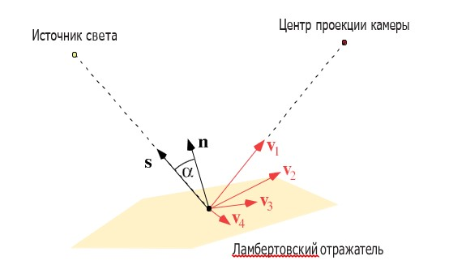

Рис. 7.22. Источник света, расположенный в направлении s, плоский ламбертовский отражатель и нормаль n к его поверхности, а также камера с направлением визирования v1. Ламбертовский отражатель излучает свет равномерно во всех направлениях v1, ..., v4 при условии, что направление принадлежит полусфере возможных направлений визирования, которая находится с освещенной стороны отражателя

Далее интенсивность излучаемого в точке P света умножается на коэффициент

$\eta(P) = \rho(P) \cdot \frac{E_L}{\pi}, \tag{7.41}$

где $E_L$ – энергия источника света, отражаемая в точке P равномерно во всех направлениях полусферы (потому-то мы и делим на $\pi$, величину телесного угла полусферы), $\rho(P)$ – постоянная характеристика отражающей способности поверхности, которая называется *альбедо* $^2$ и находится в диапазоне $0 \leq \rho(P) \leq$ .

**Врезка 7.7** (альбедо). Мы определили альбедо как скаляр, равный отношению отраженного излучения к падающему, разность между тем и другим поглощается поверхностью в данной точке. Это соответствует упрощенному использованию $E_L$ для вычисления падающего излучения.

И. Г. Ламберт дал более общее определение альбедо для отражательной способности поверхности любого типа в виде функции от длины волны λ в видимой части спектра. Поскольку здесь мы обсуждаем только ламбертовскую отражательную способность, определения альбедо как скаляра достаточно: отраженный свет не зависит от функции распределения энергии падающего излучения.

Таким образом, наблюдаемый в точке поверхности P излученный свет, называемый *отражательной способностью*, вычисляется по формуле

---

7.4. Фотометрический метод анализа стереоизображений ➔ 327

$R(P) = \eta(P) \cdot \frac{\mathbf{s}_L^T \cdot \mathbf{n}_P}{\|\mathbf{s}_L\|_2 \cdot \|\mathbf{n}_P\|_2} = \eta(P) \cdot \frac{a_L a + b_L b + 1}{\sqrt{a_L^2 + b_L^2 + 1} \cdot \sqrt{a^2 + b^2 + 1^2}}. \tag{7.42}$

Отражательная способность $R(P) \geq 0$ будет функцией второго порядка от неизвестных $a$ и $b$ , если предположить, что комбинированная отражательная способность поверхности $\eta(P)$ постоянна (т. е. мы продолжаем освещать и наблюдать одну и ту же точку, но рассматриваем разные углы визирования). Направление на источник света считается постоянным (т. е. объекты малы по сравнению с расстоянием до источника).

Карта отражательной способности определяется в градиентном пространстве $ab$ нормалей $( a, b, 1)$ , см. рис. 7.7; она сопоставляет величину отражательной способности каждому градиенту $( a, b )$ в предположении, что отражательная способность поверхности однозначно определяется градиентом (как в случае ламбертовской отражательной способности).

**Пример 7.4** (карта ламбертовской отражательной способности). Рассмотрим точку $P$ с альбедо $\rho(P)$ и градиентом $( a, b)$ .
Если $\mathbf{n}_P = \mathbf{s}_L$ , то $\alpha = 0$ и $\cos \alpha = 1$ ; формула (7.42) вырождается в $R(P) = \eta(P)$ , и это максимальное возможное значение. Мы получаем значение $\eta(P)$ в точке ($a_L, b_L$ ) градиентного пространства.
Если $\mathbf{n}_P$ перпендикулярна $\mathbf{s}_L$ , то точка $P$ «просто» не освещена, $\mathbf{n}_P$ лежит на двойственной к $\mathbf{s}_L$ прямой (показана на рис. 7.7 справа). Поскольку $\alpha = \pi/2$ и $\cos \alpha = 0$ , формула (7.42) вырождается в $R(P) = 0$ , и это минимальное возможное значение. Следовательно, на двойственной к $( a_L, b_L )$ прямой в градиентном пространстве значение $R(P)$ равно 0, и мы продолжаем нулевое значение на полуплоскость, которая определяется этой прямой и не содержит точку $( a_L, b_L) (т. е. градиенты тех точек поверхности, которые не могут быть освещены источником света $L$ ).
Для значений $R(P)$ между 0 и $\eta(P)$ формула (7.42) описывает параболу или гиперболу. Множество всех таких кривых определяет карту ламбертовской отражательной способности в градиентном пространстве, показанную на рис. 7.23.

### 7.4.2. Восстановление градиентов поверхности

Предположим, что имеется одна неподвижная камера (на треножнике) и три источника света в направлениях $\mathbf{s}_i, i = 1, 2, 3$ . Предположим, что отражательная способность $R(P)$ равномерно уменьшается в постоянное число раз $c > 0$ (из-за расстояния от поверхности объекта до камеры) и отображается в монохроматическое значение $u$ в изображении от камеры.

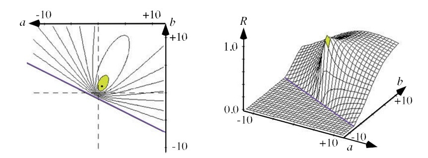
Рис. 7.23. Карта ламбертовской отражательной способности.  Слева: изолинии. Справа: трехмерное представление значений в этой карте

Мы сделаем три снимка. Каждый раз включается только один источник света, и точка поверхности $P$ отображается в три разных значения яркости (одного и того же пикселя), определяемых по формуле

$u_i = R_i(P) = \frac{\eta(P)}{c} \cdot \frac{\mathbf{s}_i^T \cdot \mathbf{n}_P}{\|\mathbf{s}_i\|_2 \cdot \|\mathbf{n}_P\|_2}. \tag{7.43}$

Это дает три кривые второго порядка в градиентном пространстве, которые (в идеале) пересекаются в точке $(a, b)$ , где $\mathbf{n}_P = [a, b, 1]$ – нормаль к поверхности в точке $P$ .

В фотометрическом методе анализа стереоизображений с $n$ источниками ($nФАС$) делается попытка восстановить нормали к поверхности с помощью некоторого практического способа определения этой идеальной точки пересечения $(a, b)$ для $n \geq 3$ . Для однозначной реконструкции нормали необходимо по меньшей мере три источника, значению $n = 3$ соответствует стандартный фотометрический метод анализа стереоизображений (ФАС).

**ФАС, не зависящий от альбедо.** Будем рассматривать поверхности с ламбертовской отражающей способностью. Например, кожа человека приблизительно удовлетворяет закону Ламберта, а проблемы возникают в местах, где имеют место блики. Зеркальные блики характерны также для открытых глаз.

Мы не можем предполагать, что альбедо $\rho(P)$ постоянно на всей ламбертовской поверхности. Изменяются цвета точек, а вместе с ними альбедо. Нужно ввести в рассмотрение ФАС, не зависящий от альбедо. Еще раз запишем формулу (7.43), но вместо $\eta(P)$ подставим его определение:

$u_i = E_i \frac{\rho(P)}{c\pi} \cdot \frac{\mathbf{s}_i^T \cdot \mathbf{n}_P}{\|\mathbf{s}_i\|_2 \cdot \|\mathbf{n}_P\|_2}, \tag{7.44}$

где $E_i$ ($i = 1, 2, 3$) – энергия источников света. Умножая первое уравнение (в котором $i = 1$) на $u_2 \cdot \|\mathbf{s}_2\|_2$, а второе на $-u_1 \cdot \|\mathbf{s}_1\|_2$ и складывая результаты, получаем:

$\rho(P) \cdot \mathbf{n}_P \cdot (E_1 u_2 \|\mathbf{s}_2\|_2 \cdot \mathbf{s}_1 - E_2 u_1 \|\mathbf{s}_1\|_2 \cdot \mathbf{s}_2) = 0. \tag{7.45}$

Это означает, что вектор $\mathbf{n}_P$ ортогонален указанной взвешенной разности векторов $\mathbf{s}_1$ и $\mathbf{s}_2$ в предположении, что $\rho(P) > 0$. В этом предположении разделим обе части на $\rho(P)$. Для первого и третьего изображений получаем аналогично

$\mathbf{n}_P \cdot (E_1 u_3 \|\mathbf{s}_3\|_2 \cdot \mathbf{s}_1 - E_3 u_1 \|\mathbf{s}_1\|_2 \cdot \mathbf{s}_3) = 0. \tag{7.46}$

В итоге получается, что вектор $\mathbf{n}_P$ коллинеарен векторному произведению

$(E_1 u_2 \|\mathbf{s}_2\|_2 \cdot \mathbf{s}_1 - E_2 u_1 \|\mathbf{s}_1\|_2 \cdot \mathbf{s}_2) \times (E_1 u_3 \|\mathbf{s}_3\|_2 \cdot \mathbf{s}_1 - E_3 u_1 \|\mathbf{s}_1\|_2 \cdot \mathbf{s}_3). \tag{7.47}$ .

Отсюда мы однозначно определяем искомую единичную нормаль к поверхности $\mathbf{n}_P$ .

Заметим, что в этом методе нам нужны только относительные интенсивности источников света и никаких абсолютных результатов измерений.

**Направление на источники и обратный ФАС.** Для калибровки направлений на три источника света $\mathbf{s}_i$ применяется обратный фотометрический метод анализа стереоизображений. Используется калибровочная сфера, обладающая (приблизительно) ламбертовской отражательной способностью и равномерным альбедо (рис. 7.24). Сфера располагается примерно в том же месте, где впоследствии нужно будет реконструировать нормали к поверхности объекта. Точность калибровки будет тем выше, чем больше сфера, т. е. желательно, чтобы она заполняла все изображение, снятое неподвижной камерой.

Мы выделяем в изображении круговую границу сферы. Это позволит вычислить нормали к поверхности сферы во всех точках $P$, проецируемых в позиции пикселей внутри этой окружности. В силу ожидаемой неточности по отношению к ламбертовской отражательной способности (см. приближенные изолинии интенсивности на рис. 7.24 справа) понадобится больше трех точек $P$ (скажем, примерно 100 равномерно распределенных точек с нормалями внутри круговой области, занятой сферой в изображении, которое было снято при освещении источником света $i$), чтобы определить направление $\mathbf{s}_i$ методом наименьших квадратов с использованием уравнения (7.44): нам известны значения $u_i$ и нормали $\mathbf{n}_P$, а требуется найти направление $\mathbf{s}_i$. Таким же образом мы измерим отношение интенсивностей $E_i$ всех трех источников света.
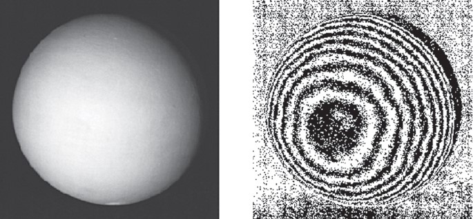
Рис. 7.24. Слева: изображение калибровочной сферы, которая в идеале должна обладать равномерным альбедо и ламбертовской отражательной способностью. Справа: обнаруженные изолинии яркости, показывающие наличие зашумленности

Что касается расположения источников света относительно объектов (или калибровочной сферы), то, согласно некоторым оценкам, для получения оптимальных результатов методом ФАС угол между направлениями на два источника (установленных симметрично относительно направления визирования камеры) должен составлять примерно 56°.

**Реконструкция альбедо.** Рассмотрим уравнение (7.44) для $i = 1, 2, 3$. Мы знаем все три значения $u_i$ в позиции пикселя $p$, являющейся проекцией пространственной точки $P$. Мы также знаем приближенные значения единичных векторов $\mathbf{s}_i^o$ и $\mathbf{n}_P^o$. Мы измерили относительные интенсивности трех источников света.

Осталось одно неизвестное – $\rho(P)$. В описанном выше методе ФАС, не зависящем от альбедо, мы комбинировали первое и второе изображения, а затем первое и третье. Можно еще скомбинировать второе изображение с третьим. Благодаря этим действиям мы можем получить надежную оценку $\rho(P)$.

Зачем нужно реконструировать альбедо? Знать альбедо важно для независимого от источников света моделирования поверхности объекта, определяемого только геометрией и текстурой (альбедо). В общем случае (если не ограничиваться ламбертовской отражательной способностью) альбедо зависит от длины волны падающего света. В качестве первого приближения мы можем использовать источники света разных цветов, например красный, зеленый и синий, чтобы реконструировать соответствующие им величины альбедо. Отметим, что, определив $\mathbf{s}^o$ и $\mathbf{n}^o$, мы должны изменять только длину волны света (например, с помощью прозрачных фильтров) в предположении, что объект остается неподвижным.

Было показано, что такая техника дает приемлемую точность реконструкции альбедо человеческого лица. См. пример на рис. 7.25.

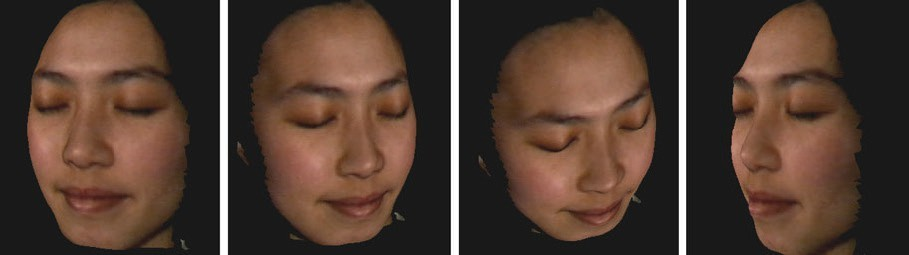

Рис. 7.25. Лицо, реконструированное методом 3ФАС  (Оклендский университет, 2000 г.). Благодаря закрытым глазам  удается избежать бликования на фотографиях

### 7.4.3. Интегрирование градиентных полей

Дискретное поле нормалей (или градиентов) можно преобразовать в поверхность путем интегрирования. Из математического анализа известно, что интегрирование неоднозначно (при работе с гладкими поверхностями), а определено лишь с точностью до аддитивной постоянной.

**Некорректность постановки задач реконструкции поверхности.** Результаты ФАС ожидаемо дают дискретные и ошибочные данные о градиентах поверхности. К тому же рассматриваемые поверхности часто «не гладкие», а, например, многогранники с разрывным поведением нормалей на границах многоугольных граней.

Чтобы проиллюстрировать трудность реконструкции на примере, предположим, что мы смотрим на лестницу, ортогональную лицам анфас. Все реконструированные нормали будут направлены прямо на нас, и мы никак не сможем восстановить лестницу по этим нормалям, которые совпадают с нормалями к плоскости.

В общем случае плотность реконструированных нормалей к поверхности изменяется не так же, как локальный наклон поверхности.

**Методы локального интегрирования.** В непрерывном случае значения функции глубины $Z = Z(x, y)$, определенной на односвязном множестве, можно реконструировать, начав с одной точки $(x_0, y_0)$ с начальным значением $Z(x_0, y_0)$ и проинтегрировав градиенты вдоль пути $\gamma$, целиком проходящим внутри этого множества. Оказывается, что интегрирование по различным путям дает одинаковое значение в точке $(x_1, y_1)$. Если быть точным, глубина $Z$ должна еще удовлетворять условию интегрируемости

$\frac{\partial Z^2}{\partial x \partial y} = \frac{\partial Z^2}{\partial y \partial x} \tag{7.48}$

во всех точках $(x, y)$ рассматриваемого односвязного множества, но это условие представляет больше теоретический интерес. На рис. 7.26 показаны два пути.
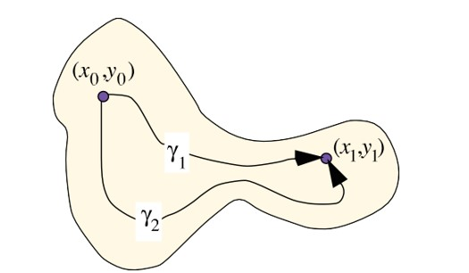
Рис. 7.26. В предположении, что участок поверхности определен на односвязном множестве и функция в явном уравнении поверхности удовлетворяет условию интегрируемости, локальное интегрирование вдоль разных путей, начинающихся в точке $(x0, y0)$ , приводит (в непрерывном случае) к одинаковым значениям возвышения в точке $(x1, y1)$

Методы локального интегрирования реализуют интегрирование вдоль выбранных путей (например, один или несколько проходов по изображению, как показано на рис. 2.10). Для инкрементного обновления значений $Z$ используются начальные значения и локальные окрестности пикселя.

**Двухпроходный метод.** Опишем локальный метод реконструкции глубины по градиентам. Мы хотим восстановить функцию глубины $Z$ такую, что

$\frac{\partial Z}{\partial x}(x, y) = a_{x, y}, \tag{7.49}$

$\frac{\partial Z}{\partial y}(x, y) = b_{x, y} \tag{7.50}$

для всех значений градиента $a_{x, y}$ и $b_{x, y}$ в позициях пикселей $(x, y) \in$ $\Omega$ .

Рассмотрим узлы сетки $(x, y + 1)$ и $(x + 1, y + 1)$ ; поскольку прямая, соединяющая точки $(x, y + 1, Z(x, y + 1))$ и $(x + 1, y + 1, Z(x + 1, y + 1))$ , приблизительно перпендикулярна средней нормали на отрезке между этими точками, скалярное произведение направляющего вектора этой прямой и средней нормали равно нулю. Отсюда получаем рекурсивное соотношение

$Z(x + 1, y + 1) = Z(x, y + 1) + \frac{1}{2}(a_{x, y + 1} + a_{x + 1, y + 1}). \tag{7.51}$

Аналогично получаем рекурсивное соотношение для пикселей $(x + 1, y)$ и $(x + 1, y + 1)$ :

$Z(x + 1, y + 1) = Z(x + 1, y) + \frac{1}{2}(b_{x + 1, y} + b_{x + 1, y + 1}). \tag{7.52}$

Сложив оба равенства и поделив результат на 2, получим

$Z(x + 1, y + 1) = \frac{1}{2}(Z(x, y + 1) + Z(x + 1, y)) + \frac{1}{4}(a_{x, y + 1} + a_{x + 1, y + 1} + b_{x + 1, y} + b_{x + 1, y + 1}). \tag{7.53}$

Предположим далее, что общее число точек на поверхности объекта равно $N_{cols} \times N_{rows}$ . Пусть в точках $(1, 1)$ и $(N_{cols}, N_{rows})$ заданы произвольные начальные значения высоты. Тогда двухпроходный алгоритм состоит из двух этапов.

**Первый этап.** Начинаем с левого верхнего угла $(1, 1)$ заданного градиентного поля и определяем значения высоты вдоль осей $x$ и $y$, для чего аппроксимируем уравнения (7.49) правилом разностей:

$Z(x, 1) = Z(x - 1, 1) + a_{x - 1, 1}, \tag{7.54}$

$Z(1, y) = Z(1, y - 1) + b_{1, y - 1}, \tag{7.55}$

где $x = 2, ..., N_{cols}$ и $y = 2, ..., N_{rows}$ .

Затем выполним вертикальный проход по изображению, применяя формулу (7.53).

**Второй этап.** Начинается в правом нижнем углу $(N_{cols}, N_{rows})$ заданного градиентного поля установкой таких значений высоты:

$Z(x-1, N_{rows}) = Z(x, N_{rows}) - a_{x, N_{rows}}, \tag{7.56}$

$Z(N_{cols}, y-1) = Z(N_{cols}, y) - b_{N_{cols}, y}. \tag{7.57}$

Затем выполняется горизонтальный проход по изображению с применением рекуррентного соотношения:

$Z(x-1, y-1) = \frac{1}{2} (Z(x-1, y) + Z(x, y-1)) - \frac{1}{4} (a_{x-1, y} + a_{x, y} + b_{x, y-1} + b_{x, y}). \tag{7.58}$

Поскольку на оценку высоты может влиять выбор начальных значений, в качестве окончательных значений мы берем среднее арифметическое значение, полученных на обоих проходах.

На рис. 7.27 показаны результаты двухпроходного метода. Синтетическое изображение вазы сгенерировано с помощью следующего явного уравнения поверхности:

$Z(x, y) = \sqrt{f^2(y) + x^2}, \tag{7.59}$

где $f(y) = 0.15 - 0.1 \cdot y(6y+1)^2(y-1)^2(5y-2)^2 $ при $-0.5 \leq x \leq 0.5$ и $0.0 \leq y \leq 1.0$ .

Это синтетическое изображение вазы показано на рис. 7.27 слева внизу, а реконструированная поверхность, полученная описанным двухпроходным алгоритмом, – на рис. 7.27 справа внизу.

**Глобальное интегрирование.** Предположим, что мы оценили векторы градиентов во всех точках $p \in \Omega$. Наша цель – сопоставить этому равномерному и плотному градиентному полю трехмерную поверхность, которая и является вероятным источником этого поля. Значения глубины $Z(x, y)$ можно интерпретировать как метки в позициях пикселей $(x, y)$ , так что мы снова сталкиваемся с задачей нахождения пометки с минимальной ошибкой (или энергией).

По аналогии с полными вариациями, рассмотренными в главе 4, мы снова сложим член данных

$E_{data}(Z) = \sum_{\Omega} [(Z_x - a)^2 + (Z_y - b)^2] + \lambda_0 \sum_{\Omega} [(Z_{xx} - a_x)^2 + (Z_{yy} - b_y)^2] \tag{7.60}$

с членом гладкости

$E_{smooth}(Z) = \lambda_1 \sum_{\Omega} [Z_x^2 + Z_y^2] + \lambda_2 \sum_{\Omega} [Z_{xx}^2 + 2Z_{xy}^2 + Z_{yy}^2], \tag{7.61}$

где $Z_x$ и $Z_y$ – первые частные производные $Z$ , $a_x$ и $b_y$ – первые частные производные $a$ и $b$ , а $Z_{xx} , Z_{xy} = Z_x$ и $Z_{yy}$ – вторые частные производные. С помощью параметра $\lambda_0 > 0$ мы управляем согласованностью между кривизной поверхности и изменениями известных градиентов, с помощью параметра $\lambda_1 > 0$ – гладкостью поверхности, а параметр $\lambda_2 > 0$ позволяет сделать еще один шаг – управлять гладкостью кривизны поверхности. В итоге мы хотим найти такую поверхность $Z$ (т. е. функцию пометки), для которой полная ошибка (или полная энергия)

$E_{total}(Z) = E_{data}(Z) + E_{smooth}(Z) \tag{7.62}$

достигает минимума, зная градиенты $(a, b)$ в точках $(x, y)$ .

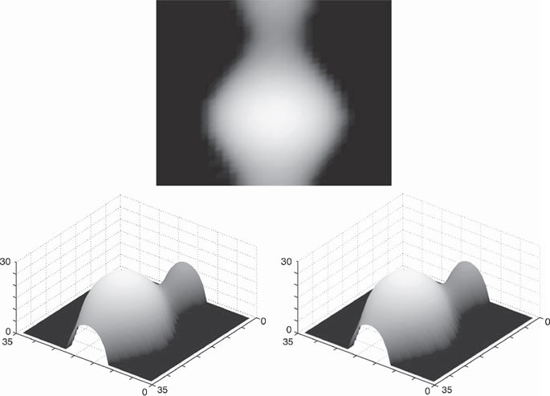
Рис. 7.27. Результаты двухпроходного метода для синтетического объекта «ваза». Сверху: исходное изображение. Слева внизу: трехмерный график вазы.  Справа внизу: результат реконструкции двухпроходным методом

**Методы на основе преобразования Фурье.** Для решения задачи минимизации (7.62) можно применить преобразование Фурье. Двумерное преобразование Фурье (см. раздел 1.2) функции поверхности $Z(x, y)$ определяется следующим образом:

$\mathcal{Z}(u, v) = \frac{1}{|\Omega|} \sum_{\Omega} Z(x, y) \cdot \exp \left[ -i2\pi \left( \frac{xu}{N_{cols}} + \frac{yv}{N_{rows}} \right) \right], \tag{7.63}$

а обратное преобразование Фурье:

$Z(x, y) = \sum_{\Omega} \mathcal{Z}(u, v) \cdot \exp \left[ i2\pi \left( \frac{xu}{N_{cols}} + \frac{yv}{N_{rows}} \right) \right], \tag{7.64}$

где $i = \sqrt{-1}$ – мнимая единица, а $u$ и $v$ – частоты в двумерной области Фурье.

**Врезка 7.8 (методы на основе преобразования Фурье).** Задачу оптимизации (7.62) можно решить, применив теорию проекций на выпуклое множество. Заданное градиентное поле $(a_{x,y}, b_{x,y})$ проецируется на ближайшее в смысле среднеквадратичной погрешности интегрируемое градиентное поле, причем оптимизация производится в частотной области с помощью преобразования Фурье. См. работу [R. T. Frankot and R. Chellappa. A method for enforcing integrability in shape from shading algorithms. IEEE Trans. Pattern Analysis Machine Intelligence, vol. 10, 1988, p. 439–451] для случая, когда вторая часть ограничения на данные не используется, а ограничения на гладкость отсутствуют вовсе.

Чтобы улучшить точность и устойчивость алгоритма, а также усилить связь между функцией поверхности $Z$ и заданным градиентным полем, в уравнение (7.62) можно включить дополнительные ограничения, как описано в работе [T. Wei and R. Klette. Depth recovery from noisy gradient vector fields using regularization. In Proc. Computer Analysis Images Patterns, LNCS 2756, Springer, 2003, p. 116–123].

Помимо пар Фурье, перечисленных в разделе 1.2, имеют место также следующие:

$Z_x(x, y) \Leftrightarrow iu\mathcal{Z}(u, v);$

$Z_y(x, y) \Leftrightarrow iv\mathcal{Z}(u, v)$

$Z_{xx}(x, y) \Leftrightarrow -u^2\mathcal{Z}(u, v);$

$Z_{yy}(x, y) \Leftrightarrow -v^2\mathcal{Z}(u, v);$

$Z_{xy}(x, y) \Leftrightarrow -uv\mathcal{Z}(u, v).$

Эти пары Фурье определяют внешний вид интересующих нас производных функции $Z$ в частотной области.

Обозначим $\mathcal{A}(u, v)$ и $\mathcal{B}(u, v)$ – преобразования Фурье заданных градиентов $A(x, y) = a_{x,y}$ и $B(x, y) = b_{x,y}$ соответственно. Нам понадобится также теорема Парсеваля, см. (1.31).

**Алгоритмы Франкота–Челлаппа и Вэя–Клетте.** Имеет место эквивалентность между задачей оптимизации (7.62) в пространственной области и задачей оптимизации в частотной области, заключающейся в минимизации выражения

$$ \begin{aligned}
\sum_{\Omega} &[(iu\mathcal{Z} - \mathcal{A})^2 + (iv\mathcal{Z} - \mathcal{B})^2] + \lambda_0 \sum_{\Omega} [(-u^2\mathcal{Z} - iu\mathcal{A})^2 + (-v^2\mathcal{Z} - iv\mathcal{B})^2] \\
&+ \lambda_1 \sum_{\Omega} [(iu\mathcal{Z})^2 + (iv\mathcal{Z})^2] + \lambda_2 \sum_{\Omega} [-u^2\mathcal{Z}^2 + 2(-uv\mathcal{Z})^2 + (-v^2\mathcal{Z})^2].
\end{aligned} \tag{7.65} $$

Раскрывая скобки в этом выражении, получаем:

$$ \begin{aligned}
\sum_{\Omega} [ &u^2\mathcal{Z}\mathcal{Z}^* - iu\mathcal{Z}\mathcal{A}^* + iu\mathcal{Z}^*\mathcal{A} + \mathcal{A}\mathcal{A}^* + v^2\mathcal{Z}\mathcal{Z}^* - iv\mathcal{Z}\mathcal{B}^* + iv\mathcal{Z}^*\mathcal{B} + \mathcal{B}\mathcal{B}^*] \\
+ \lambda_0 \sum_{\Omega} [ &u^4\mathcal{Z}\mathcal{Z}^* - iu^3\mathcal{Z}\mathcal{A}^* + iu^3\mathcal{Z}^*\mathcal{A} + u^2\mathcal{A}\mathcal{A}^* + v^4\mathcal{Z}\mathcal{Z}^* - iv^3\mathcal{Z}\mathcal{B}^* + iv^3\mathcal{Z}^*\mathcal{B} + v^2\mathcal{B}\mathcal{B}^*] \\
+ \lambda_1 \sum_{\Omega} &(u^2 + v^2)\mathcal{Z}\mathcal{Z}^* + \lambda_2 \sum_{\Omega} (u^4 + 2u^2v^2 + v^4)\mathcal{Z}\mathcal{Z}^*,
\end{aligned} \tag{7.66} $$

где $*$ обозначает комплексное сопряжение.

Дифференцируя по $\mathcal{Z}^*$ и приравнивая производную к нулю, мы выведем необходимо условие минимума функции стоимости (7.62) в виде:

$(u^2\mathcal{Z} + iu\mathcal{A} + v^2\mathcal{Z} + iv\mathcal{B}) + \lambda_0 (u^4\mathcal{Z} + iu^3\mathcal{A} + v^4\mathcal{Z} + iv^3\mathcal{B}) + \lambda_1 (u^2 + v^2)\mathcal{Z} + \lambda_2 (u^4 + 2u^2v^2 + v^4)\mathcal{Z} = 0. \tag{7.67}$

После перегруппировки членов получаем:

$[\lambda_0 (u^4 + v^4) + (1 + \lambda_1)(u^2 + v^2) + \lambda_2 (u^2 + v^2)^2] \mathcal{Z}(u, v) + i(u + \lambda_0 u^3) \mathcal{A}(u, v) + i(v + \lambda_0 v^3) \mathcal{B}(u, v) = 0. \tag{7.68}$

Решаем это уравнение при условии $(u, v) \neq (0, 0)$:

$\mathcal{Z}(u, v) = \frac{-i(u + \lambda_0 u^3) \mathcal{A}(u, v) - i(v + \lambda_0 v^3) \mathcal{B}(u, v)}{\lambda_0 (u^4 + v^4) + (1 + \lambda_1)(u^2 + v^2) + \lambda_2 (u^2 + v^2)^2}. \tag{7.69}$

Это преобразование Фурье неизвестной поверхности $Z(x, y)$, выраженное в виде функции от преобразований Фурье заданных градиентов $A(x, y) = a_{x,y}$ и $B(x, y) = b_{x,y}$ . Получающийся в результате алгоритм представлен на рис. 7.28.

1: вход градиенты a(x, y), b(x, y); параметры λ₀, λ₁, λ₂
2: for (x, y) ∈ Ω
3: if |a(x, y)| < c_max & |b(x, y)| < c_max then
4: A1(x, y) = a(x, y); A2(x, y) = 0;
5: B1(x, y) = b(x, y); B2(x, y) = 0;
6: else
7: A1(x, y) = 0; A2(x, y) = 0;
8: B1(x, y) = 0; B2(x, y) = 0;
9: end if
10: end for
11: Вычислить преобразование Фурье на месте: A1(u, v), A2(u, v);
12: Вычислить преобразование Фурье на месте: B1(u, v), B2(u, v);
13: for (u, v) ∈ Ω
14: if (u ≠ 0 & v ≠ 0) then
15: Δ = λ₀ (u⁴ + v⁴) + (1 + λ₁)(u² + v²) + λ₂ (u² + v²)²
16: H1(u, v) = [(u + λ₀ u³)A2(u, v) + (v + λ₀ v³)B2(u, v)] / Δ
17: H2(u, v) = [-(u + λ₀ u³)A1(u, v) - (v + λ₀ v³)B1(u, v)] / Δ
18: else
19: H1(0, 0) = средняя глубина; H2(0, 0) = 0;
20: end if
21: end for
22: Вычислить обратное преобразование Фурье H1(u, v) и H2(u, v) на месте: H1(x, y), H2(x, y);
23: for (x, y) ∈ Ω
24: Z(x, y) = H1(x, y);
25: end for

**Рис. 7.28.** Алгоритм Вэя–Клетте на основе преобразования Фурье (обобщение алгоритма Франкота–Челлаппа, в котором $\lambda_0 = \lambda_1 = \lambda_2 = 0$ , и потому вторая часть ограничения на данные, а также ограничение на гладкость целиком не используются) для вычисления оптимальной поверхности по заданному плотному градиентному полю.

Постоянная $c_{max}$ позволяет отбросить оценки градиентов, в которых углы с плоскостью изображения близки к $\pi/2$ , подходящим значением является $c_{max} = 12$. Вещественные части хранятся в массивах A1, B1 и H1, а мнимые – в массивах A2, B2 и H2. В строке 19 для инициализации используется оценка средней глубины видимой сцены. Параметры $\lambda_0, \lambda_1, \lambda_2$ следует выбирать, исходя из экспериментальных данных для заданной сцены.

На рис. 7.29 показано три фотографии гипсового бюста Бетховена, снятые неподвижной камерой с тремя источниками света. Градиенты вычислялись с помощью независимого от альбедо метода 3ФАС. На рисунке ниже показаны реконструированные поверхности при одном и том же плотном градиентном поле на входе, но с $\lambda_0 = 0$ (как в алгоритме Франкота–Челлаппа) и с $\lambda_0 = 0,5$ (как в алгоритме Вэя–Клетте); для уточнения реконструированной поверхности можно попробовать положительные значения $\lambda_1$ и $\lambda_2$ .
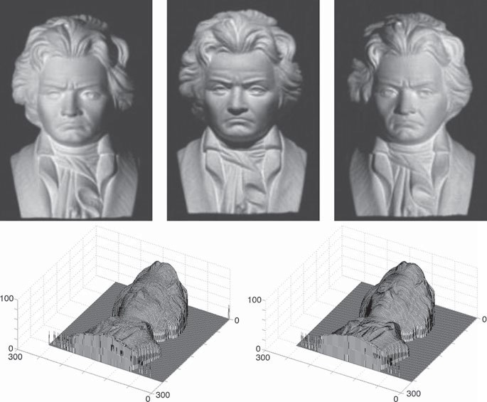
Рис. 7.29. Вверху: три изображения бюста Бетховена, использованные  в качестве входных данных для метода 3ФАС. Слева внизу: поверхность, реконструированная с помощью алгоритма Франкота–Челлаппа.  Справа внизу: поверхность, реконструированная с помощью  алгоритма Вэя–Клетте с параметрами 𝜆0 = 0.5, 𝜆1 = 𝜆2 = 0

**Тест на зашумленные градиенты.** Вообще говоря, локальные методы дают ненадежную реконструкцию, если на вход подаются зашумленные градиенты, поскольку ошибки распространяются вдоль пути обхода. Мы проиллюстрируем глобальное интегрирование для показанного на рис. 7.27 синтетического изображения вазы. Сгенерируем для него дискретное градиентное векторное поле и прибавим к нему гауссовский шум (с нулевым средним и стандартным отклонением 0,01). Результаты показаны на рис. 7.30.
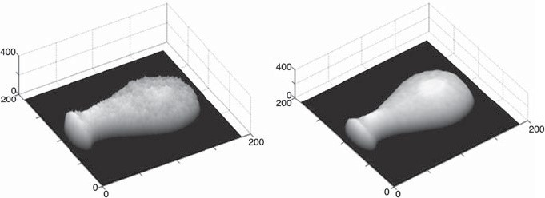
Рис. 7.30. Результаты реконструкции синтетической вазы (рис. 7.27)  при зашумленном градиентном поле. Слева: поверхность,  реконструированная с помощью алгоритма Франкота–Челлаппа.  Справа: поверхность, реконструированная с помощью алгоритма  Вэя–Клетте с параметрами 𝜆0 = 0, 𝜆1 = 0.1, 𝜆2 = 1

### 7.5. Упражнения

#### 7.5.1. Упражнения по программированию

**Упражнение 7.1. (отображение поверхности цилиндрического тела на плоскость).** Решите следующую задачу. Дан набор изображений одного цилиндрического объекта, например банки или бутылки (см. рис. 7.31). Разрешается построить загораживающий контур объекта вручную, а не автоматически.

Рис. 7.31. Слева: пример входного изображения цилиндрического тела  с наклеенной этикеткой. В середине: приближенное положение загораживающих контуров цилиндра, построенное вручную. Справа: плоская метка, выделенная  из нескольких входных изображений

Сделайте несколько фотографий цилиндрического объекта, на которых присутствует какая-нибудь «интересная» часть (на рис. 7.31 это этикетка). Ваша программа должна выполнить следующие действия:
1)  отобразить каждое изображение на один и тот же цилиндр фиксированного радиуса;
2)  воспользоваться _сшивкой изображений, чтобы объединить сегменты изображений на поверхности этого цилиндра;
3)  отобразить сшитое изображение на плоскость.

Тем самым вы должны получить плоское представление некоторых частей заданного цилиндрического объекта, как показано в примере на рис. 7.31.

**Упражнение 7.2 (визуализация кривизны подобия).** Визуализируйте кривизну подобия для трехмерных поверхностей. Значением кривизны подобия является вектор в $\mathbb{R}^2$. На рис. 7.32 показаны два возможных цветовых ключа для первого (горизонтальная ось) и второго (вертикальная ось) элементов пары, определяющей кривизну подобия, а также применение этой цветовой схемы к нескольким простым фигурам.

Выберите по своему усмотрению несколько трехмерных тел, каждое со своим масштабом, и визуализируйте их кривизну подобия, нанеся значения цветовых ключей на их поверхности.

Обобщите результаты своих экспериментов по визуализации кривизны подобия одного и того же тела в разных масштабах.
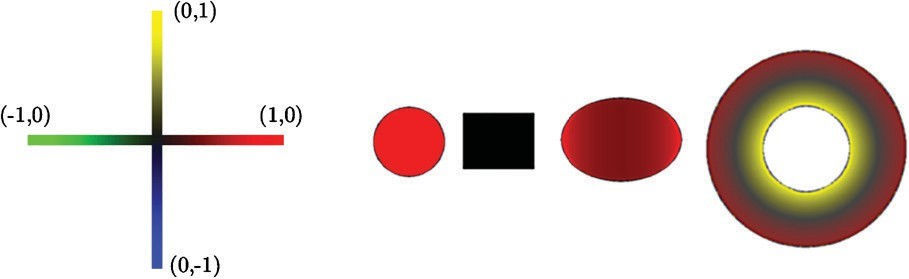

Рис. 7.32. Слева: возможный цветовой ключ для визуализации кривизны подобия. Справа: применение этого ключа к сфере, цилиндру, эллипсоиду и тору

**Упражнение 7.3 (построение простого 3D-сканера).** В этом проекте рассматривается «очень простой» способ построить 3D-сканер. Предполагается, что имеется цифровая камера и плоский источник света (например, потолочный проектор или источник типа того, что используется для просмотра рентгеновских снимков; впрочем, обе технологии уже устарели).

Вырежьте из картона круг, на котором помещались бы объекты размером от 20 до 50 см (например, деревянная статуэтка), нанесите по краям шкалу в градусах (скажем, с шагом 5 градусов), положите круг на стол, обведите его контур и пометьте на этой окружности место, где в начальный момент находилась нулевая отметка шкалы. После этого можно будет поворачивать круг внутри окружности на указанные вдоль его края углы.

Теперь создайте фиксированную световую плоскость, проходящую через ось вращения круга, для чего закройте свой плоский источник света двумя листами бумаги, оставив между ними очень узкую щель. (Конечно, для создания световой плоскости лучше было бы использовать свет лазера и оптический клин.)

Расположите камеру так, чтобы она «видела» вращающийся круг, и откалибруйте расстояния следующим образом: перемещая какой-нибудь предмет, например книгу, внутри круга точно измеренными шагами, определите столбец (или столбцы) изображения, в которых световая плоскость видна на предмете при данном расстоянии. Тем самым вы создадите таблицу соответствия между освещенными столбцами изображения от камеры и расстояниями.

Теперь всё готово к нахождению точек на поверхности объекта, помещенного на вращающийся круг. Составьте отчет об эксперименте и приложите к нему входные изображения и реконструированный набор точек на трехмерной поверхности.

**Упражнение 7.4 (недостоверность стереореконструкции).** На рис. 7.17 иллюстрируется недостоверность вычисленных значений диспаратности. Точки пересечения прямых отмечают потенциальные положения в трехмерном пространстве, которые определяются вычисленными диспаратностями, но на самом деле точка поверхности, которой соответствует диспаратность, может находиться внутри трапеции вокруг точки пересечения. Площади таких трапеций (т. е. недостоверность) возрастают с увеличением расстояния до камер.

В действительности на рисунке показана только одна плоскость, определенная общей строкой в левом и правом изображениях. Области недостоверности являются трехмерными многогранниками, а трапеции – это всего лишь их плоские сечения.

В этом упражнении необходимо провести геометрический анализ объема этих многогранников (в качестве упрощения можно ограничиться площадью трапеций) и графически представить недостоверность в виде функции от расстояния до камер.

Считайте, что имеется две камеры с фиксированным разрешением $N_{rows} \times N_{cols}$ в канонической конфигурации стереоскопической системы с фокусным расстоянием $f$ и длиной базы $b$ . Постройте график зависимости недостоверности от расстояния до камер; изменяйте только $f$ и покажите, как при этом изменяется недостоверность. Затем изменяйте только $b$ и снова покажите, как при этом изменяется недостоверность. В идеале интерфейс программы должен допускать интерактивное изменение $f$ и $b$ .

**Упражнение 7.5 (удаление небольших бликов).** Описанный метод ФАС работает, только если отражательная способность поверхности близка к ламбертовской. Однако если текстура поверхности «не слишком детальная», то небольшие блики можно «удалить», воспользовавшись _дихроматической моделью отражения_ для цветных поверхностей.

Возьмите объект, поверхность которого состоит лишь из участков приблизительно постоянного цвета, на которых есть небольшие блики. Сфотографируйте этот объект и отобразите значения пикселей внутри одного участка постоянного цвета в цветовой куб RGB. Эти значения должны образовать T- или L-образную линию в кубе RGB, определяемую базовой линией (диффузной компонентой) и более яркими значениями вдали от базовой линии (блики).

Аппроксимируйте базовую линию и ортогонально спроецируйте на нее RGB-значения. Замените в изображении спроецированные значения их проекциями на базовую линию.

Таким образом можно удалить небольшие блики. Продемонстрируйте это на нескольких изображениях выбранного объекта под разными углами зрения и при разных условиях освещения.

#### 7.5.2. Упражнения, не требующие программирования

**Упражнение 7.6.** Гладкое компактное множество в трехмерном пространстве является компактным (т. е. связным, ограниченным и топологически замкнутым) и таким, что кривизна определена в любой точке края (т. е. поверхность дифференцируема в любой точке).

Докажите, что кривизна подобия $\mathcal{J}$ , определенная в (7.12), является (положительным) инвариантом относительно масштабирования для любого гладкого трехмерного множества.

**Упражнение 7.7.** Вместо того чтобы применять тригонометрический подход в рассуждениях на стр. 313, специфицируйте детали для реализации линейно-алгебраического подхода к структурной подсветке, руководствуясь следующими указаниями.
1.  В результате калибровки мы знаем неявное уравнение каждой световой плоскости в мировых координатах.
2.  В результате калибровки мы также знаем параметрические уравнения (в мировых координатах) лучей, соединяющих центр проекции камеры с центрами каждого квадратного пикселя.
3.  Анализ изображения дает нам идентификатор световой плоскости, видимой в позиции данного пикселя.
4.  Пересечение луча со световой плоскостью дает координаты точки на поверхности.

**Упражнение 7.8.** Определите фундаментальную матрицу $\mathbf{F}$ для канонической геометрии стереоскопической системы. Рассмотрите также пару наклоненных камер, показанных на рис. 7.20, и определите для нее фундаментальную матрицу.

**Упражнение 7.9.** Опишите карту ламбертовской отражательной способности в сферических координатах на гауссовой сфере (указание: в этом случае линиями равной интенсивности будут окружности). Воспользуйтесь этой моделью, чтобы ответить на вопрос о том, почему двух источников света недостаточно для однозначного определения нормали к поверхности.

**Упражнение 7.10.** К чему на стр. 336 предложение «Нам понадобится также теорема Парсеваля…»?

---

